> 本文原作于2020年10月

虽然我们住在长三角这块，但是想看海并不容易。有句笑话：去上海看不到海。

其实这句笑话并不严谨，上海市三面都是海岸线，要想看到海是很容易的。我就曾经在奉贤区海湾镇看过上海的海，只不过那海水混着大量钱塘江带出来的泥沙，完全没有海的蓝色。上海其他方向的海岸线大抵也是如此。

上海的南面是舟山群岛，舟山群岛最著名的旅游景点叫做普陀山，是佛教名山，山上有个巨大的观音像，号称南海观音。遗憾的是普陀山周围的海也是黄色的，看着它你完全找不到大海的感觉。

也许因为四年前我看到普陀山的海之后很失望，所以去嵊山枸杞的想法早就在我心中默默地计划起来了。最近机缘巧合家人都有时间，天气也不错，终于决定带一家老小去看海了。

因为是全家老小出行，所以我的计划特意注意了控制节奏，不让老人小孩行程太赶。看海四日游计划更像是海边度假计划。

上海，枸杞，嵊山位置图。

利用完整的四日三晚时间，我们大致的行程计划如下。

第一天：从苏州出发自驾到达上海最东南角的滴水湖，下午游玩海昌海洋公园，晚上住在海洋公园附近的酒店。
第二天：早上七点多起来自驾经过东海大桥，到达沈家湾码头。把车就停在码头的停车场，然后坐大约4个小时的渡船到达枸杞岛。下了船直接去预定的民俗，民宿位于嵊山岛东崖绝壁旁边。下午休息休息，然后去东崖绝壁景区里游玩。
第三天：早上看日出。游玩嵊山岛其他景点比如无人村，然后在镇上吃午饭，逛一逛。下午回民宿休息。
第四天：早上再看一次日出。游玩枸杞岛景点如山海奇观，大王沙滩等。中午乘船离开枸杞岛，晚上自驾回到苏州。

计划的第一天之所以不坐船上岛，是因为从上海的码头到枸杞岛的班船是上午九点多的，我们从苏州出发要赶班船的话时间会非常的紧。再加上船程本身又有四个小时之久，这样赶路的话很可能会导致大家真的**舟车劳顿**。

## 第一日，周六

上午预计车程只有两个小时，所以我们都睡到自然醒，慢悠悠吃个早饭，加个油才出发。
十一点多到了滴水湖（也就是临港自贸区）的一个商场附近，我们打算在这里吃过午饭再进到海昌海洋公园。

结果吃饭的地方上菜实在太慢了，我们拖到下午两点才入园。海洋公园不仅有各种水族馆，还有很多过山车之类的游乐设施。

但是我们两个老人一个小孩，主要还是带他们看看企鹅看看鲨鱼，看看大海龟。

逛了两个多小时，太阳快要落山了，小孩太累睡着了，只好去酒店了。

因为我们买的四张全天票，350块一张，玩得时间却很短，很多游乐设施也玩不了，感觉远远没值回票价。不过作为去看海路上顺路的一个景点，也算是一个不错的选择了。

晚上住的叫做桔子水晶酒店，感觉还不错，挑不出任何毛病，离海洋公园还非常近。旁边有个小超市，非常方便补给。

## 第二日，周日

清晨拉开窗帘的酒店景色。

一早起来我很兴奋，因为很期待看到真正的大海。之前跟小孩说以后带他去看大海，去看大船，去看灯塔，这些承诺马上都要兑现了。

但是小孩的妈妈和姥姥带他睡一房，也许都没睡好，所以起床起的晚，也没怎么吃早饭就匆忙上路了。说到这里可以吐槽一下桔子水晶酒店了：每间房两人入住，却只给一张早餐券。住过那么多或好或差的酒店，还没见过这种操作的。

### 东海大桥与嵊泗班轮

我们开车经过了东海大桥——连接上海与洋山深水港的一座长度超过30公里的超级跨海大桥。然后车上的人都兴奋了起来，因为我们开车深入到大海之中了。

东海大桥，网图。

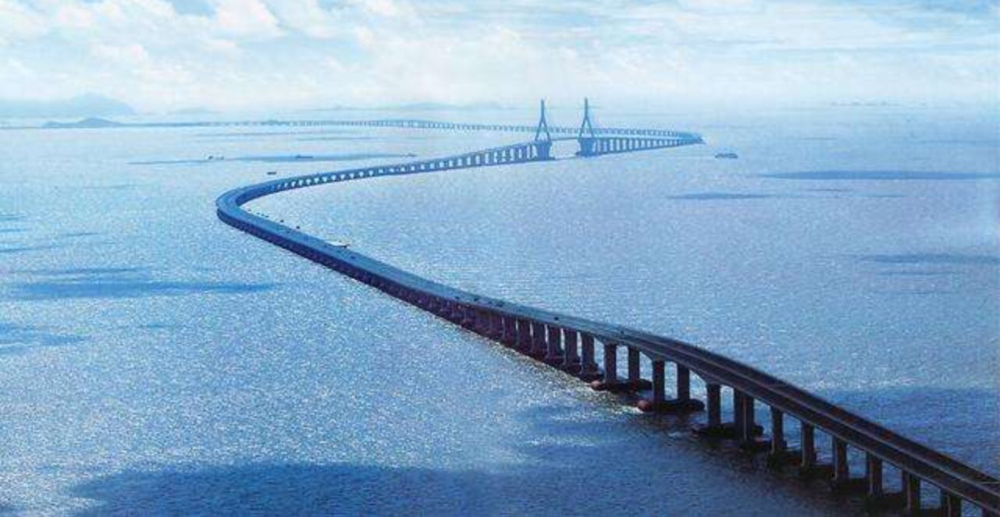

从滴水湖到沈家湾码头从地图上看也就过一座跨海大桥，但是因为桥上限速八十，下了桥还要走一段，所以前后也花了五十分钟。

> 洋山港和沈家湾码头行政上都属于嵊泗县，但是他们所在的小洋山岛和沈家湾岛离上海直线距离近，再加上东海大桥已经建好了十几年了，所以看起来这里更像是上海的一部分。

> 在十年前我在杭州上学时，有个师兄姓谢，他家就在嵊泗县。当时他跟我说他每次回家都要先到上海，从上海南站坐车去芦潮港或者小洋山港（其实指的就是沈家湾码头），最后坐船回嵊泗。因为这个路线与直观想象的从杭州经过宁波和舟山再去嵊泗的路线完全不同，所以我印象深刻。

船票我们已经通过公众号“嵊泗客运总站”提前买好了。这个公众号有每天所有嵊泗县内县际的船期，如果班船取消或者更改经停路线，也会提前通知。

从沈家湾码头到枸杞岛干斜码头的客滚船（客货混装船）经停嵊泗主岛的大柱山码头，总共耗时四小时，票价（淡季）80元。

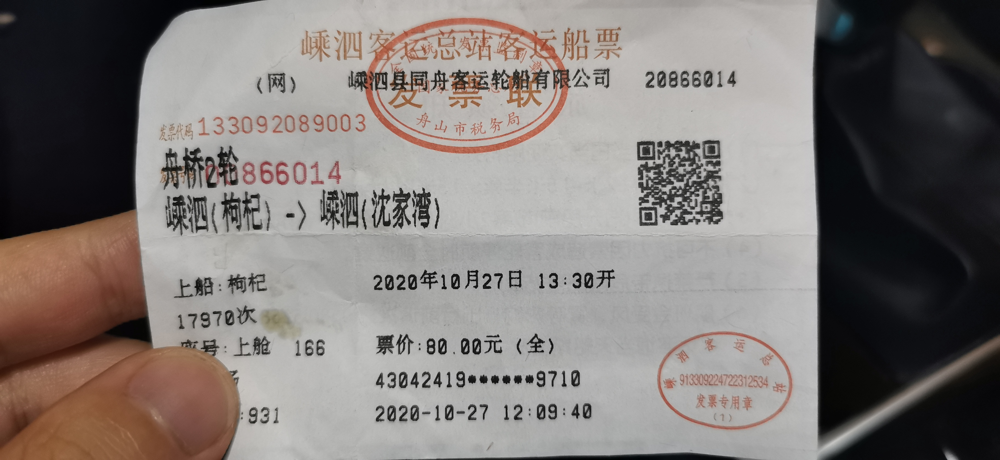

经过短暂的等候我们终于上了船。虽然我没有坐过那种开往济州岛或者冲绳的大游轮，但是想必现在坐的这种常规客货渡轮更适合我们出游。过长时间的海上航行肯定会非常乏味，但是仅仅四个小时的船程却可以充满趣味。

刚上船，周围的海水都仍然是黄黄的。

船舱肚子里都是各色客货车，包括许多空车去岛上拉海鲜的货车。客舱在上部，空间比较大，小孩一会在客舱里跑来跑去，一会让我们带着在船舷上看风景。

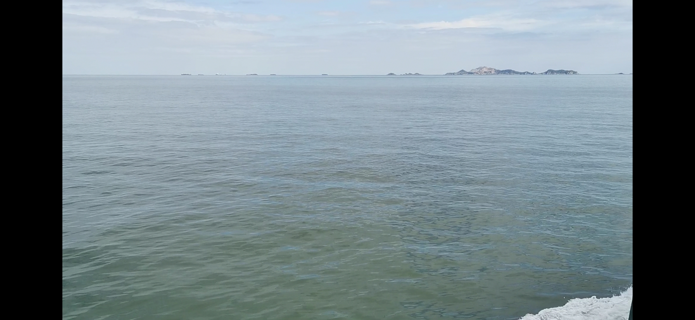

大约快十二点的时候中途停靠大柱山码头，位于嵊泗本岛——泗礁山的西北角。因为中途这一停，整个行程差不多多花了一个小时。有时候因为风浪等原因，这班船有可能中途不停靠嵊泗本岛。

我们在船上把昨晚从酒店旁边小超市买来的自热米饭吃掉了。这样也没感觉船上的时间太漫长，就在一点半左右到达了枸杞岛的干斜码头。

即将靠岸干斜码头，海水终于一点黄色都没有了。

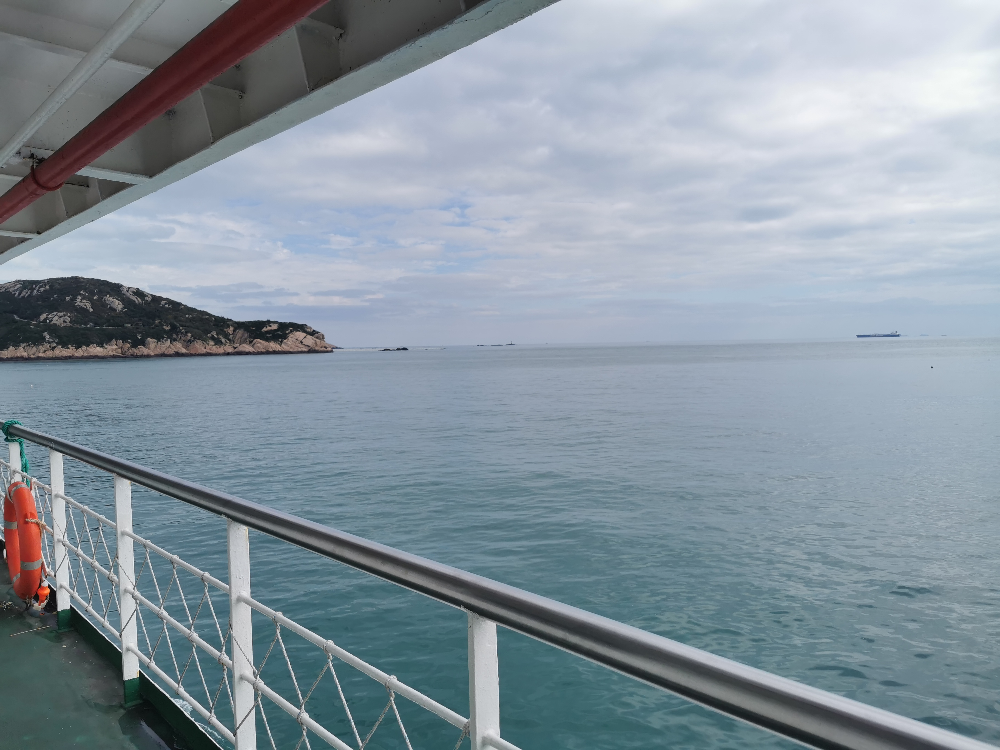

### 登岛枸杞嵊山

民宿是大约两三天前通过电话联系订好的。因为是淡季，我没有直接在携程上下单，而是找到电话号码一通电话打过去，先砍砍价，让店家送早餐什么的。最后的价格比携程超级会员的价格还是要好一些的。

枸杞岛与嵊山岛卫星地图。

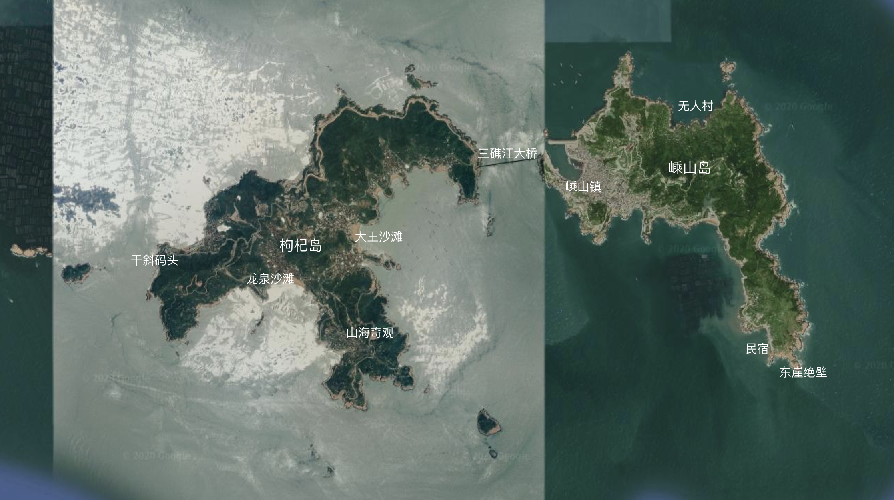

在码头出口等了二十分钟终于等到了民宿老板娘开车过来接我们。她的车是七座长安欧尚的SUV，装下我们五个人还是有富余的。去民宿的一路上恰好是从枸杞岛的最西端到嵊山岛的最东端，当中路过的许多景色都非常原生态。比如马路旁边废弃的渔船，晾晒的渔网，嵊山镇街道旁窄小的店铺，还有渔港里锈迹斑斑的拖网渔船。

贻贝养殖场。

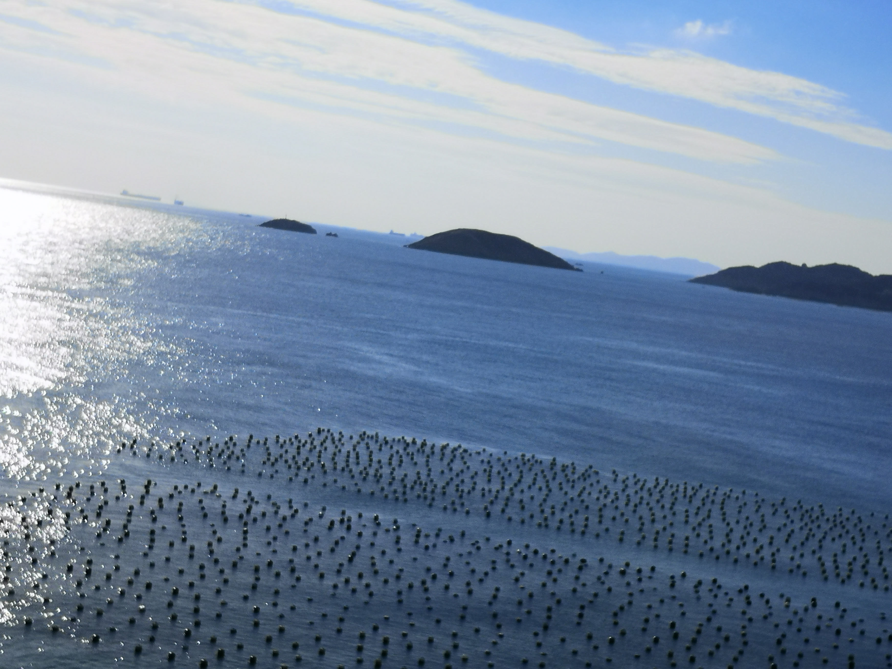

但是也有一些商业化过重的痕迹，比如仿圣托里尼风格的蓝房子，我是非常不喜欢这种文化不自信的东西的。

到了民宿之后，我才发现我们定的这家民宿就在东崖绝壁景区大门口旁边二十米，再也没有更近的民宿了。但是刚放下行李，老板娘就告诉了一个让我们震惊的消息——东崖绝壁因为景区大门口要修一栋楼，十几天前就完全关闭了。

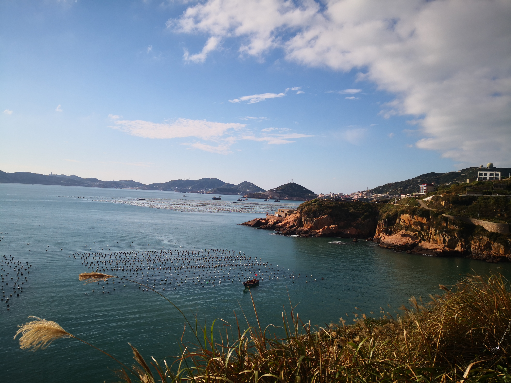

我听到这个消息心里直骂娘。要是早知道景区关闭了，我又何必定他们家的房间呢？
这个景区既然关闭，为何网上搜索不到任何相关信息？而且接下来两天我发现每天都有许多花了一百块打车费的游客到了这里进不去 ，然后又要沮丧地打车回去。这个景区实在是太不尊重游客了，根本没有发布任何通知。

小孩已经一路旅途疲惫睡着了，我们把他放到房间里的床上，我自己也索性先睡个午觉再说了。

小孩的姥爷一直想看海，这次终于看到海了，他也是非常兴奋。但是他全然不知道这其中的细节，只是发现门口的这个景区已经闭门谢客了。在我睡午觉又心情烦躁睡不着的时候，他自顾自顺着目所能及的小路往山上爬去。

等到小孩睡醒时，已经是下午三点多。无论如何，我们都决定一起在这个民宿附近走走。

### 东崖绝壁探险

东崖绝壁景区附近的山路卫星图。

此时恰好小孩他姥爷已经从山上转了一圈下来了，他兴奋地跟我们说，山上有路可以走，可以看到山那边的大海。于是我们一行五人都一起跟他往山上走去。

我们上了一段台阶，轮流抱着小孩往上走。走到台阶尽头然后往相反方向拐过去，大约又走了十分钟就走到了一段山脊上。这一路上两旁都是无人居住的房子。后来从地图上看，才知道这里是嵊山岛最南面的山脊。我们终于远眺到南面的大海了，可是走到路的尽头，是一道铁门。小孩他姥爷说，他刚才一个人上来探路的时候，有个年轻人直接翻越旁边的铁栅栏进去了。

举起手机，高过铁栅栏拍摄到的景色。

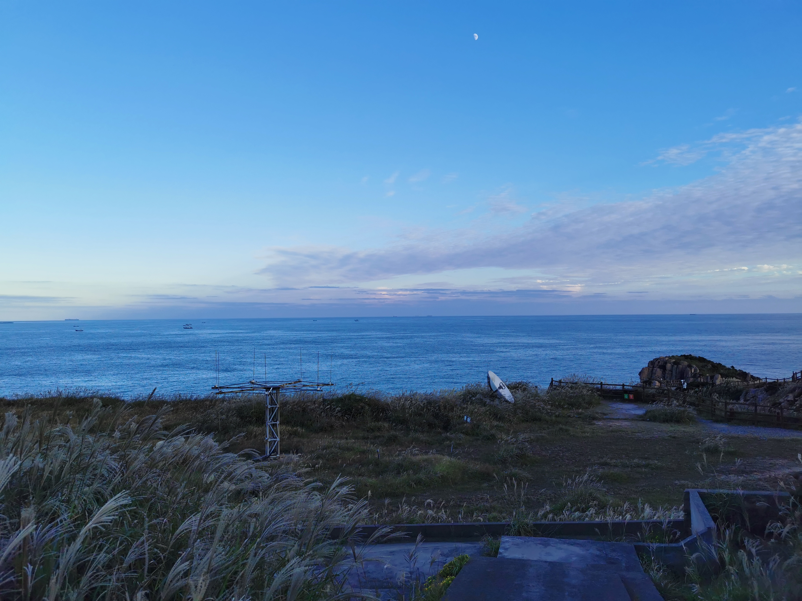

这铁栅栏将近我的身高，越过铁栅栏看去，已经可以看到悬崖峭壁的顶上的大石头了。可以肯定的是，这里面就是东崖绝壁的景区了。铁栅栏并不矮，上面又有那种阻止别人攀爬的尖刺，就算我勉强可以爬过去，可是我们这个老年旅游团不可能都爬得过去呀。我很沮丧但是还没有彻底放弃。我们试图从铁栅栏别的部位翻越，几次尝试都失败了。

我又推了两下铁栅栏，发现它其实非常松散，本身是网状的结构，并且下面没有扎进土里固定。如果我用力往前推，铁栅栏向前凹进去，同时地面恰好是向前下坡的一个斜坡，就有可能“挖”出来一个狗洞。说干就干，很快我还真就在铁门旁边找到一个这样的地方。我把地面上厚厚的草丛清除掉之后，背部贴着地面钻进狗洞，成功“逃票”。然后对于老年旅游团来说这个动作也并没有多少难度，只需要站起来后拍拍屁股上的灰。还有就是小孩也被我们连哄带骗贴着斜坡拖进来了。

怀揣探险猎奇的兴奋，我们一路蹑手蹑脚往里头走，生怕被景区内值守的工作人员发现，直到终于瞥见那海边的悬崖绝壁。

随后我们不再担心工作人员。小孩见到了大灯塔一直指着说看灯塔灯塔。整个景区里只有我们五个人在栈道上穿行，拍照。

位于景区内，嵊山岛最南端的大灯塔。

近看绝壁下的景色。

东崖绝壁最南面的大礁石。

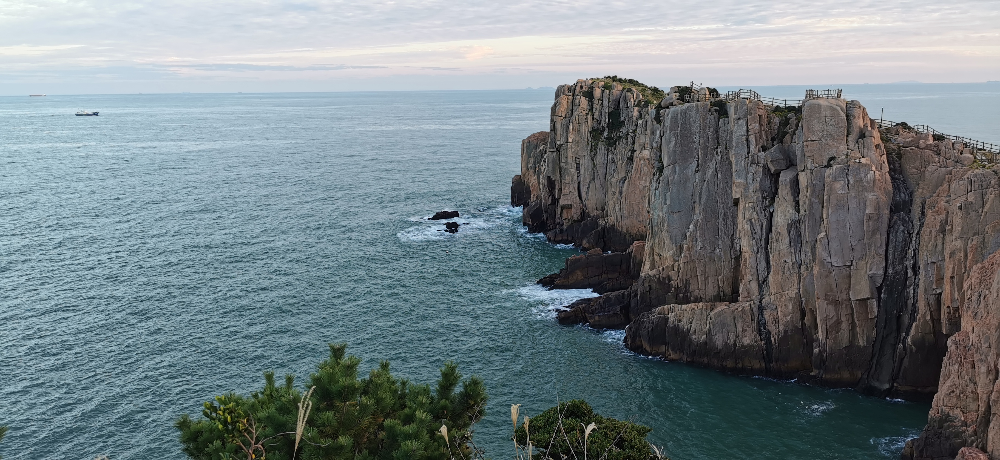

景区内标识的最佳日出摄影点，往正东方向是东海深处，不再有岛屿，只有星星点点打鱼的船。

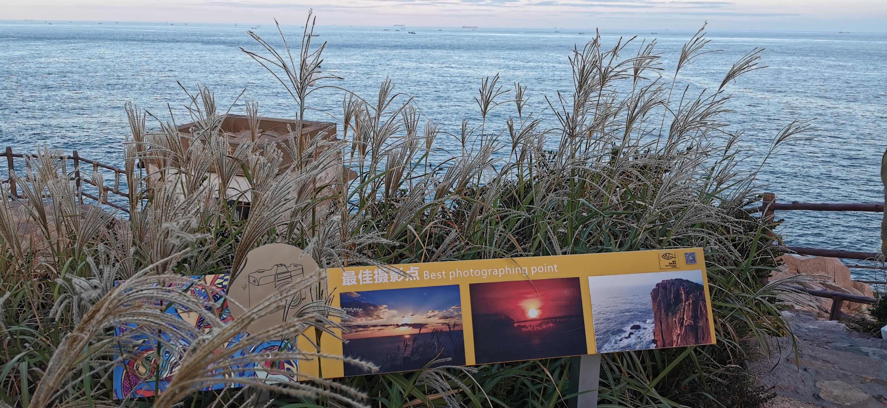

我们一直逛到太阳快要落山，才决定往回走，这个时候气温也迅速凉下来了。

往太阳落山的方向看过去，步道前方延伸到了景区的正门。

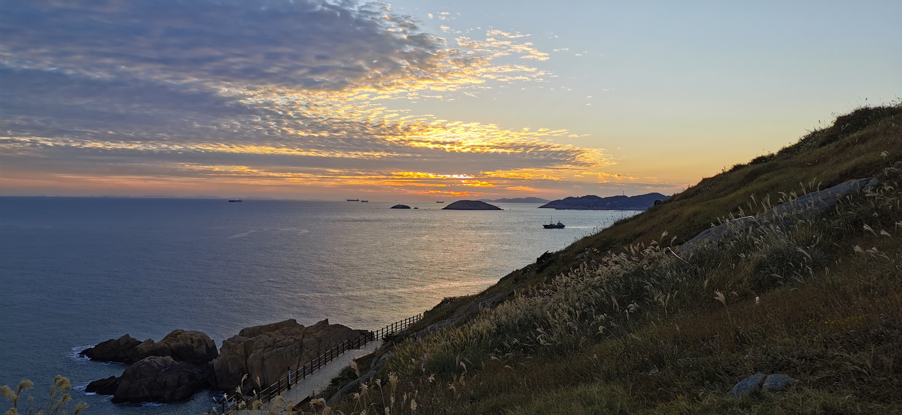

我们沿着原路“狗洞”返回，因为不想走正门被工作人员抓到从而节外生枝。

下山之后，太阳就真的落下去了。我们的探险竟然圆满结束了。

### 海鲜晚餐？

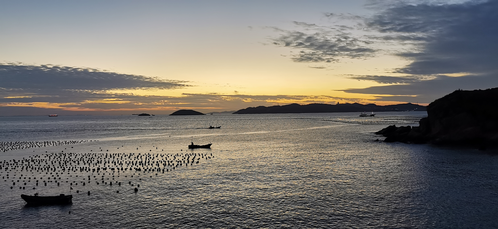

晚上我们在民宿吃饭，点了一条一斤多的黑鲷，一碗青椒炒贻贝，一份青菜，总共一百七十多块。我也不知道算不算贵，理论上现在东海是开放捕鱼的时候，海鲜价格应该很便宜。但是在民宿里住，只能闭着眼睛相信老板开价良心了。

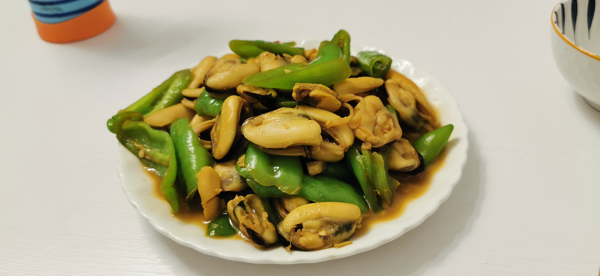

## 第三日，周一

前一晚我已经要求民宿老板一早带我去东崖绝壁景区里面看日出，因为我表达出对他隐瞒景区关门的情况很不满。他说他知道一条小路，说不用走山路，也不知道到底怎么走。

早上五点被老板叫醒，只我一个人跟着他去看日出，老老小小们起不了那么早。他带着我从景区大门前的临海一侧往下翻，沿着大门外头的陡坡绕过了景区大门，然后又翻上了景区里的栈道。也许我家里人没法穿越这条路线，但是对我来说确实比走山路钻狗洞方便多了。

天还未亮，海面上可以看到清晨出海的渔船。

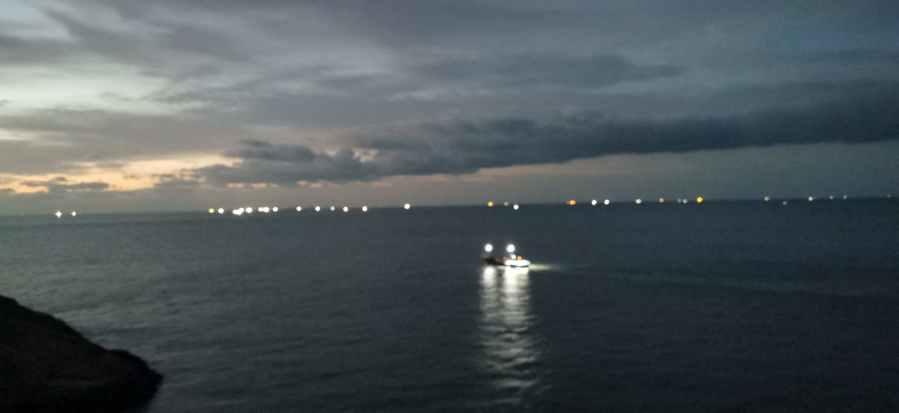

此时可以注意到海面上一点都不平静，因为有太多太多的渔船发动机的声音了。所以我是失算了，这里虽然是长三角最偏僻的地方了，却并不是一个安静的所在，也许我家里人晚上睡觉都会被渔船突突突的声音吵到。

沿着栈道来到昨天来过的官方最佳摄影点，可以看到远处海天相接的地方有厚厚的云层。老板跟我说，今天是看不到天边的日出了，只能看到云后的日出。我随意拍了几张照片，决定还是回去睡觉了。现在想来有点后悔，早早爬起来还是应该看看太阳出来后的景色。不管是哪里的风景，清晨的光线往往塑造了风景最美的时刻。

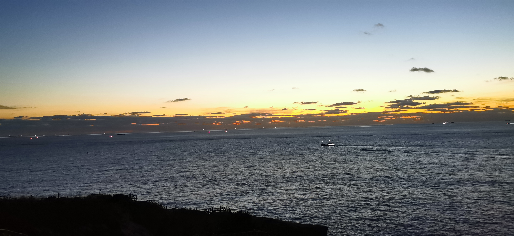

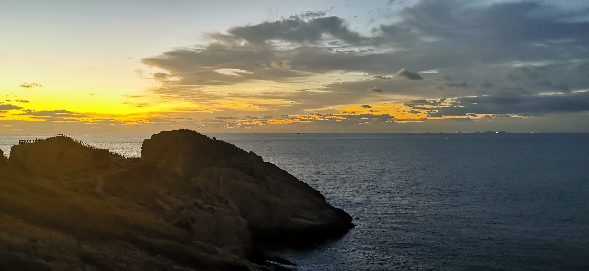

### 无人村之旅

民宿提供的早餐还不错，馒头鸡蛋白米粥还有油炸花生米，很扎实。我们今天的打算就是上午玩无人村和一些小的景点，然后下午回来睡觉。

包下民宿老板的车在嵊山岛上逛一上午是一百块，比自己打出租肯定是要划算很多。我们根据老板娘的推荐，先在去无人村的路旁一个小沙滩上玩了一会。大家因为时间关系都意犹未尽地上了车，并且一致同意明天再找个大的沙滩玩到爽。

无人村的入口在一块山顶上，游客买票进去后需要一路下台阶才能深入到无人村里面。

俯瞰无人村。

事实上如果时间紧，站在山头上看看风景就够了。不下到山脚下的话还可以买观景平台的单票，更便宜，而且节省时间。

>后头湾村位于浙江省嵊泗县嵊山岛东北面，是全国著名的舟山渔场中心，经济区位优越，海洋资源丰富。此处原本是嵊山镇居民居住的主要区域之一。20世纪50年代，后头湾曾是当地最富裕的渔村。上世纪90年代起，渔业发展，不少村民富裕起来。为了生活便利，村民都们陆续搬离后头湾。这是一个海岛上的老渔村，面朝大海，却人去楼空，因为村落旧址紧邻着一片坟场，当地人已经习惯于把后头湾村叫“鬼村”。上世纪八十年代，很多人家开始搬离。2002年，后头湾整村搬迁，撤销建制归并至民富村。村民搬到新居后，废弃的老屋任由植物将它慢慢“吞噬”，村落变成令人意想不到的无人村。

我猜测这个无人村南面靠山，北面靠海从而日照不足且只能承受北风可能是才是最后村民整体放弃这个村落的主要原因。

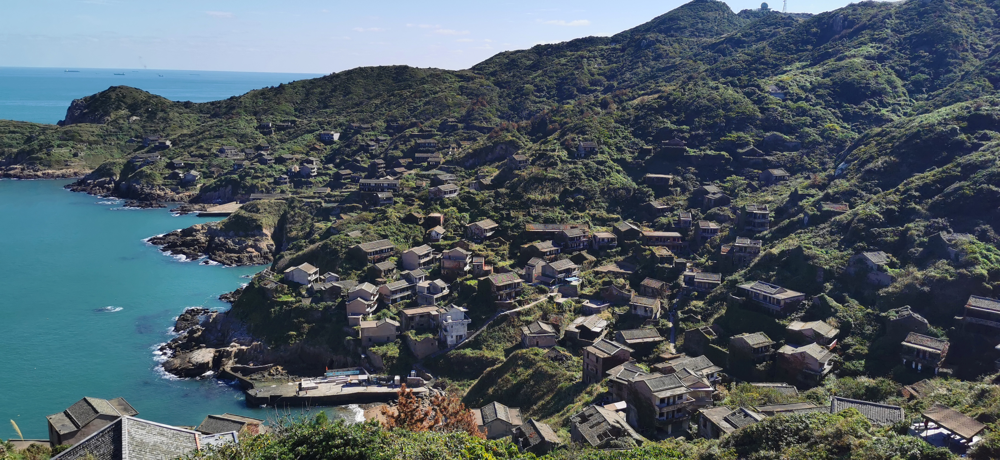

我们轮流抱着小孩下到了无人村的码头边，然后又抱着他爬上来，都累得够呛。

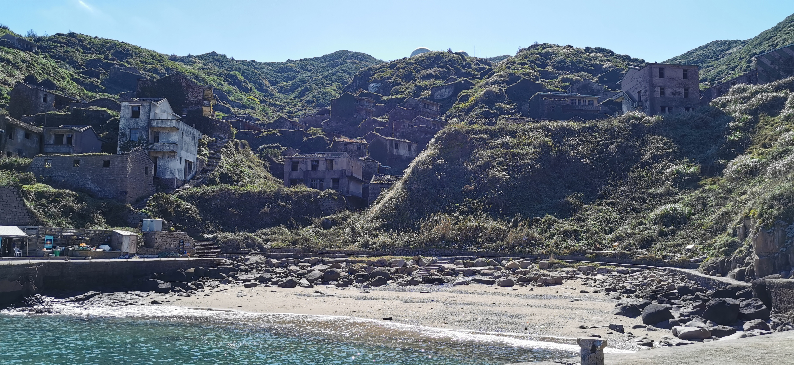

我们晚上在民宿吃晚饭的时候又点了条比黑鲷更贵的石斑鱼，也不知道是不是被宰了。小孩不好好吃饭很伤脑筋。

## 第四日，周二

最后一天的计划就是坐民宿老板娘的车，把行李放车上，在枸杞岛上玩一圈然后去码头坐船。老板娘开价80块，这个可以肯定是良心价了。

### 山海奇观

山海奇观和大王沙滩是枸杞岛上最著名的两个景点了。因为大王沙滩仍然要收费，于是我们听从老板娘的建议，先去山海奇观然后再去另一个免费的沙滩——龙泉沙滩。

山海奇观其实就是枸杞岛南面的一个制高点，从这里可以远眺整个嵊山岛和三礁江大桥。

从高处观枸杞嵊山全景，远处从右向左依次是东崖绝壁，嵊山镇，三礁江大桥，大王沙滩。而无人村则在嵊山岛高处的背面。

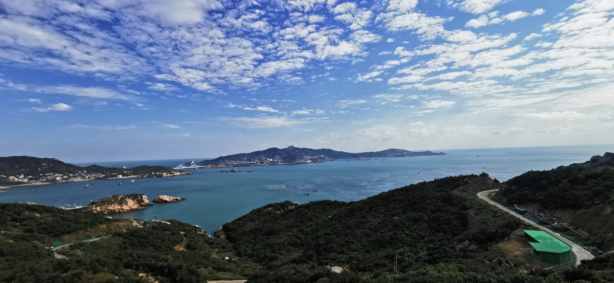

往西面看，还可以看到龙泉沙滩和嵊泗本岛方向。往南看，则只能看到浪岗山列岛了。

远眺三礁江大桥方向，更远处是一望无际的东海。

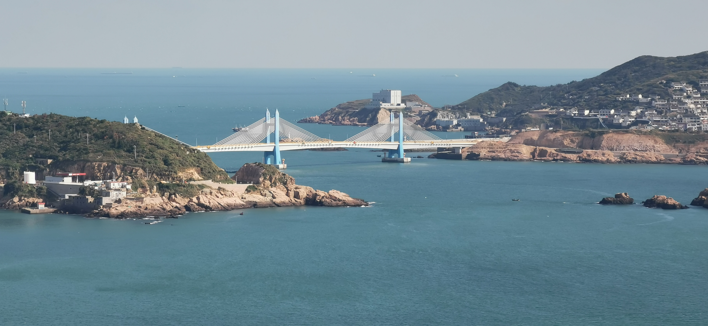

虽然民宿老板娘一直说就那样，但是我觉得这里还是很值得上来看看。

### 龙泉沙滩

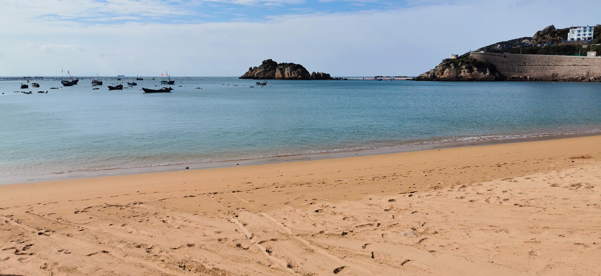

龙泉沙滩的面积跟大王沙滩差不多。我们下来之后恰好碰到另外一家人在沙滩上玩，他们都脱了鞋子下水了。

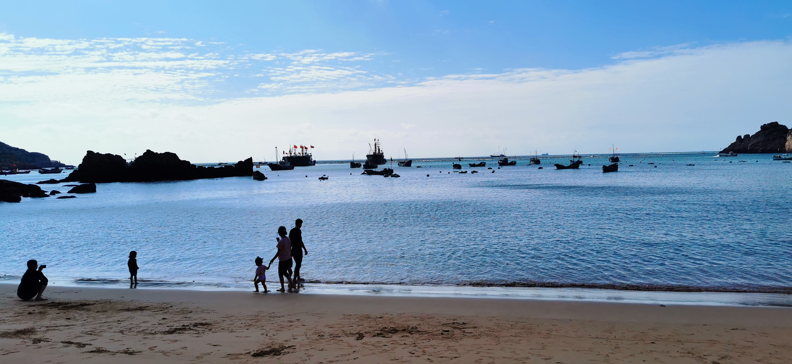

我不小心被海浪弄湿了一点点鞋子，于是索性也脱了鞋子在水里踩一踩。

我们玩得很尽兴，因为最后大家的鞋子都被海浪给打湿了。

### 回家

因为龙泉沙滩附近没有吃午饭的地方，我们打算先去干斜码头看看有没有吃的。到了码头的候船室里发现只有一个卖玉米的小卖部。买到玉米之后发现玉米都是馊的，非常坑人。

回程的船已经不那么让人兴奋了，但是当船快要靠岸沈家湾码头的时候，同船的游客都纷纷站到船舷上看夕阳，拍照。

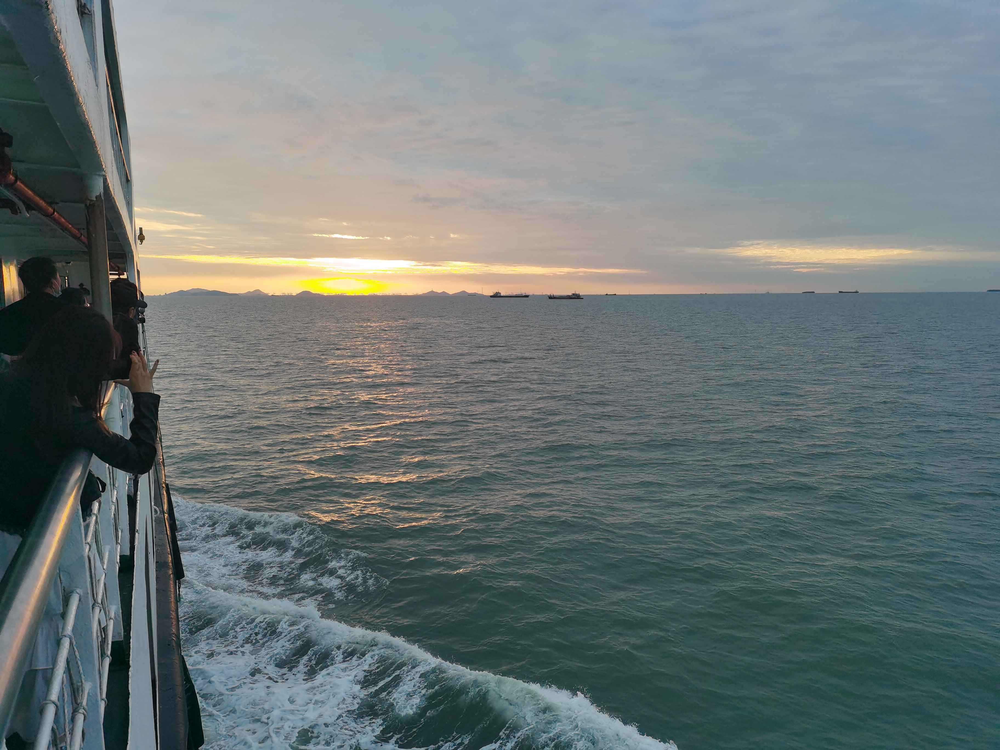

远眺夕阳下的洋山深水港，可见密密麻麻的龙门吊。

>洋山深水港号称是世界上最大的自动化集装箱码头。洋山港西北距上海市南汇芦潮港约32公里，南至宁波北仑港约90公里，距国际航线仅45海里，是距上海最近的深水良港。它于2005年12月10日开港，在业务上属于上海港港区，行政区划仍然属于浙江省嵊泗县。
>2016年，上海洋山港完成货物吞吐量7.02亿吨，完成集装箱吞吐量3713万标准箱，同比去年增长3.5%，自2010年以来连续7年保持世界第一。

下船之后，我们在码头餐厅吃了一顿还不错的快餐。然后我打起精神两个半小时一口气把车安全开回了家，结束了看海四日游。

**总体感受，不虚此行啊！**

## 后记：谁是华东地区最东端的岛屿？

嵊泗列岛及其周边卫星地图。

对于普通旅游者而言，嵊山岛就是我们能够到达的东海最东端了。他是整个华东地区最东端的**有常住居民的岛屿**。东崖绝壁那个日出摄影点，也差不多是我们在长三角地区最早能见到太阳的地方了。

### 东极岛

东极岛，是当年韩寒电影《后会无期》的取景地。上映后，许多人都通过这部电影知道了这个地方。

不过，它还有另一个为大众所知的原因——号称“中国大陆最东端的岛屿”。毕竟东极这两个字挂在脸上。

其实整个舟山群岛都不如辽东半岛更靠东。辽东半岛鸭绿江口附近的大大小小岛屿有太多都比东极岛更靠东了。

而在舟山群岛内部，东极岛也不如嵊山岛和浪岗山列岛更靠东。他并不是东海沿海或者说华东地区最东端的岛屿，所以东极岛名不副实。

### 浪岗山列岛

在嵊山岛或者枸杞岛的高处往正南方向看，总是很容易看到不远处还有三个山头，中间的那个山头最高称作中块岛。那就是浪岗山列岛。

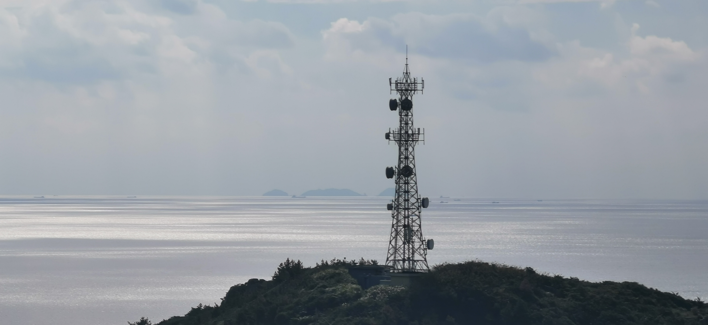

浪岗山列岛是中国东海最东面的或者说是华东地区最东端的**有人居住的岛屿**，它几乎在嵊山岛的正南面，但是却又稍稍偏东。从枸杞岛或者嵊山岛可以清楚地看到浪岗山列岛。但是其实他们之间的直线距离有三十公里远。如果乘坐我们登岛时坐的那种客滚轮，从嵊山岛到浪岗山列岛需要一个多小时。

>浪岗山列岛行政区域位于嵊山镇。因有管理权争议，舟山市人民政府决定，浪岗山列岛行政管理由舟山市本级负责。
>浪岗山列岛呈北北东—南南西走向，主要岛屿地形崎岖、陡峻，海蚀崖峭立如壁，不易攀登。
>浪岗山列岛远离大岛，地势险要，旧时不适合人类生存，有“浪岗三块山，上下实烦难，家有薄粥饭，永不上此山”之说。历为海防重地，是舟山群岛重要的外围线，从海上进出舟山群岛的重要门户。
>浪岗中块岛旧为渔民临时作业点，在7-9月渔汛期，原有数百名渔民在岛上生产、临时居住。1956年，舟山专署水产局在岛中部西岸建固定码头1座、登陆点1个，可供200吨以下船舶停靠，在岛中部东岸建登陆点1个，可供小船靠泊。
>1968—1996年曾驻军，留有大量废弃营房。20世纪90年代后，渔业资源衰退，临时居住人员锐减。现为海钓爱好者喜爱的海钓点，建有海钓俱乐部，主要渔获物有黑鲷、真鲷、石鲷、鲈鱼等。

### 两兄弟屿

然而浪岗山列岛仍然不是**华东沿海最东端的岛屿**，在它的正南面稍稍稍稍偏东方向又三十公里远的地方，还有两块无人居住的大礁石——两兄弟屿。

>两兄弟屿（岛），位于中街山列岛东端， 由中块、东块、西块、笋等组成，从东或西望之，似两块，故名。面积0.02平方公里，最高点西块岛海拔27.9米。草木罕见。海鸥、海燕栖息地。附近海域为中街山渔场，盛产带鱼、乌贼等。
>两兄弟岛是中国领海基点之一， 2006年中国人民解放军海军在岛上竖立了领海基点石碑。

两兄弟屿网图。

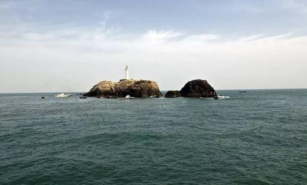

在行政上它属于东极岛上的政府——东极镇政府管辖，因此东极岛在“最东端的岛屿”这个名头上似乎又扳回了一城。