2023年的端午节前，我决定带全家去呼伦贝尔旅游。这是我们疫情放开之后第一次出远门旅游。

原本我很想去新疆，可是去新疆的机票实在太贵了。而且据说此时由于临近古尔邦节，伊犁的宾馆爆满，独库公路大堵车，让人望而却步。于是，呼伦贝尔就备胎转正，成为了我们2023年的第一个成行的目的地。

我们请了三天假，连公休假一共八天假期。直飞呼伦贝尔机场的航班有点贵，而且时间点不太好，于是我决定先飞哈尔滨，在哈尔滨玩一天之后乘坐一晚火车卧铺到达呼伦贝尔。

## 6月17日

凌晨，我们降落在哈尔滨机场，然后打车去市区的一家酒店。这家酒店叫做兰卡精致酒店，设施和服务都很一般，低于预期。由于飞机延误，等我们睡下时已经凌晨一点多了。我有点后悔——刚出发的交通和住宿我都没安排好。

上午，我们打车去**东北虎林园**。东北虎林园的特色是坐在铁笼子车里给外面放养的老虎喂食。逛完整个虎林园之后，我觉得一般般。主要是期待中的小老虎没有看到，也不知道是这里本来就没有还是我们没找到。

再有就是这里的门票比较贵，让人不爽。大门口的牌子上写着“来这里的游客都是为东北虎捐款”。我要早知道门票里面还包含捐款部分，就不来了。

我们在大门口的老虎头那里晃荡了一会，就打车去了哈尔滨市中心。

哈尔滨市中心的地标是**索菲亚大教堂**。现实中看这座教堂很漂亮。

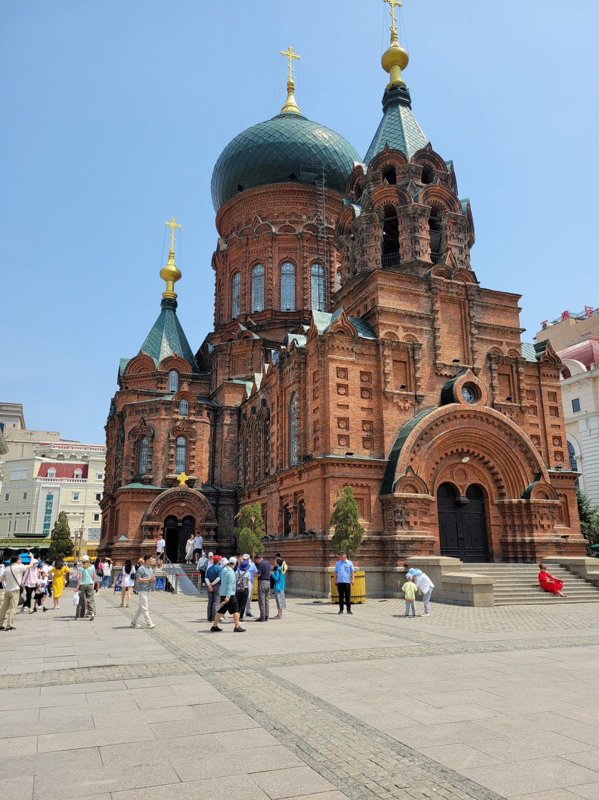

我们在教堂旁边的广场上逛了逛，然后又去了教堂内部。教堂中心的舞台上有人正在演奏，这使得教堂内很有氛围感。

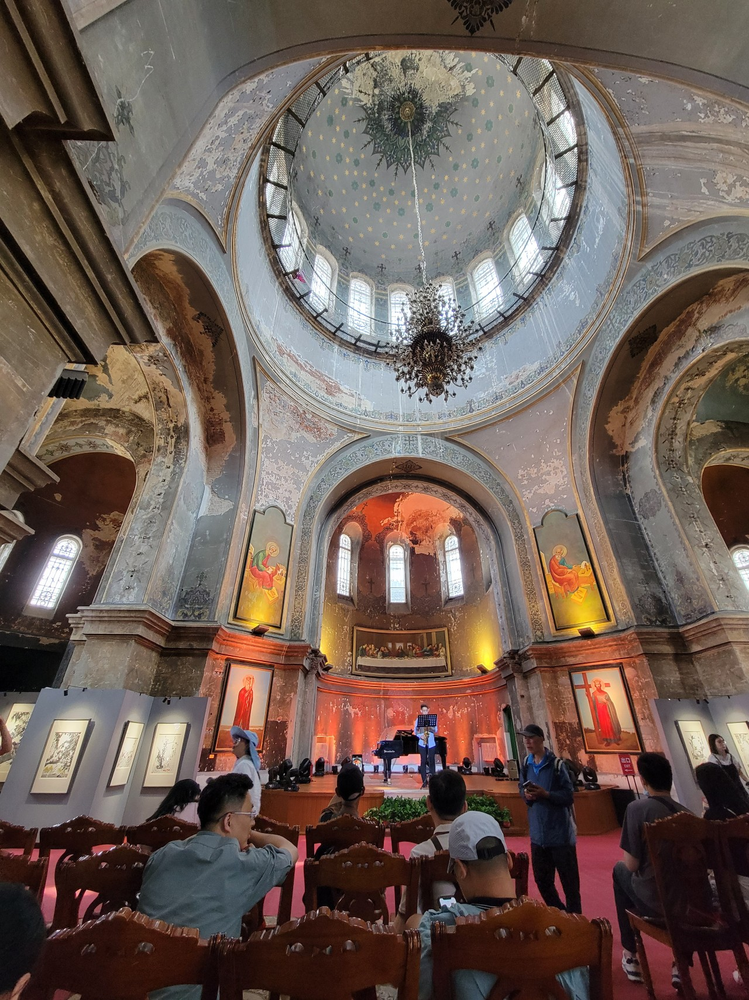

吃过午饭，我们又去逛了**中央大街**。正值周末，这条石板铺成的步行街上人头攒动。

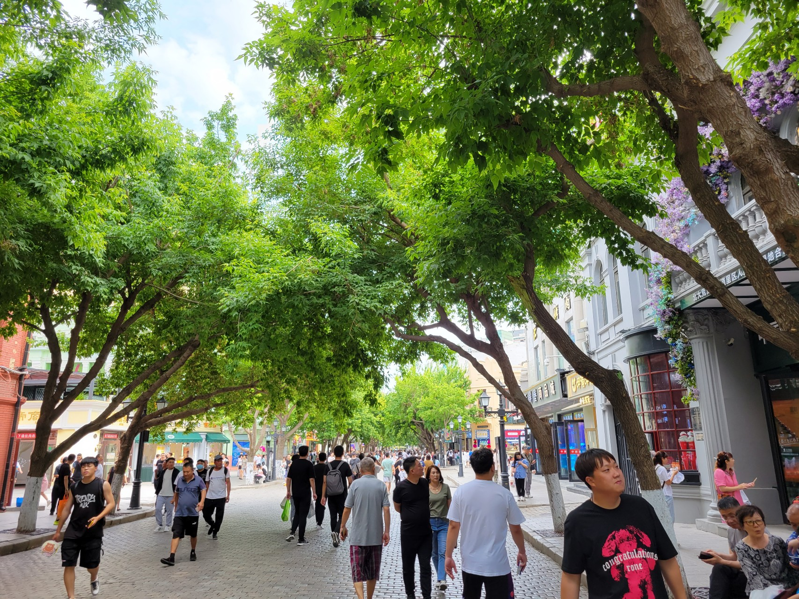

我们逛了不少黑龙江地方特色的店铺。

最后去中央大街南门口打卡。

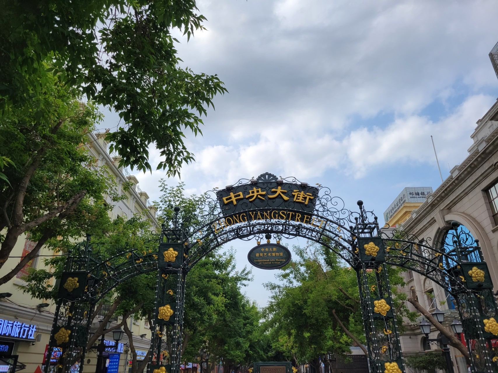

此时，天色还早，我们带着小朋友去了儿童公园活动活动。

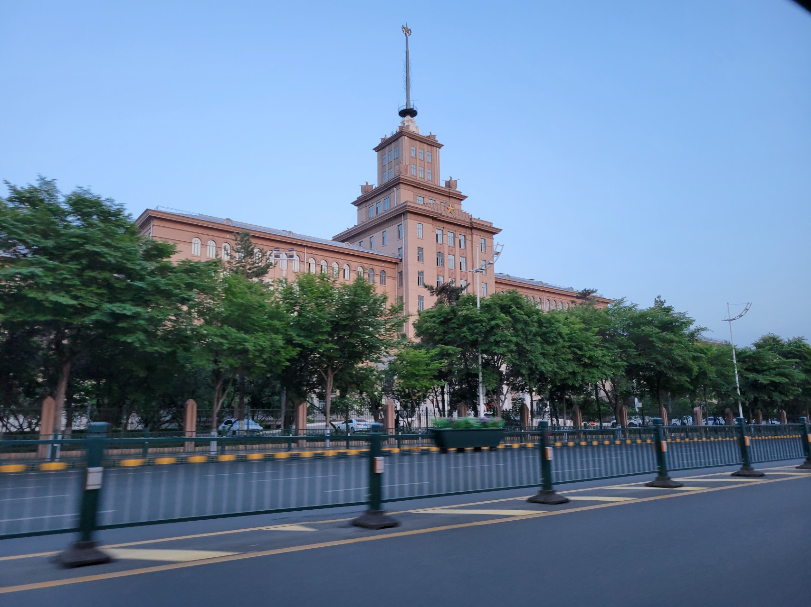

最后，我们打车去往哈尔滨西站，路上还经过了著名的**哈尔滨工业大学**。

## 6月18日

一早，我们乘坐的K7091次列车到达了海拉尔火车站。

在过去，海拉尔市是呼伦贝尔盟的政府所在地。后来，呼伦贝尔盟改为地级市，海拉尔市就变成了海拉尔区。但是，铁路部门可懒得去修改海拉尔站的站名。所以，你至今都找不到一个叫“呼伦贝尔站”的火车站。

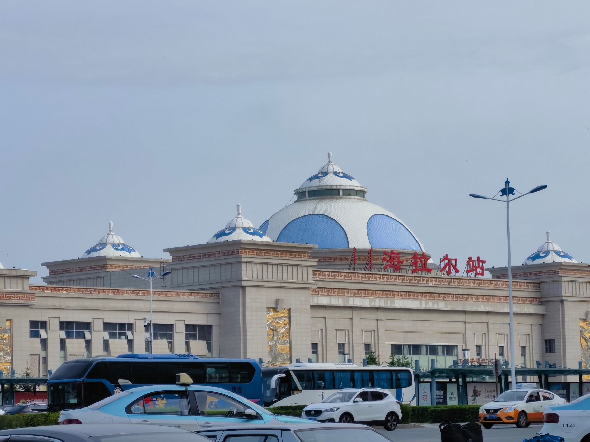

我通过携程从当地一家叫做“歆尧租车”的公司那里租了一辆坦克300。在呼伦贝尔，本地的租车公司很多并且竞争激烈。所以，直营的神州租车和一嗨租车都毫无竞争力。

我们计划花费6天时间，在这比江浙沪三省市加起来面积还大的呼伦贝尔地区转一个小小的圈。

而第一天我们的目的地是额尔古纳市。

上午，我们去了**莫日格勒河**。天气不太好有点灰蒙蒙，所以景色也一般。

河边最高的那个观景台正在修栈道，不让人上去。估计是马上要收费了。可是此时即便我掏钱也不让上去，我们只好继续往前走。

经过一个叫做鄂温克民族苏木的镇子之后，道路变得破碎起来。我们的坦克300甚至一度托底了。中午一点，我们才赶到额尔古纳市，在市区找了家能吃羊肉的馆子解解馋。

额尔古纳市因额尔古纳河得名，额尔古纳河是黑龙江的上游，在内蒙古自治区这段是中俄界河。

最近有一本书很火，叫做《额尔古纳河右岸》。河的右岸就是指顺着河流的方向的右手边。额尔古纳河从南向北流，所以额尔古纳河右岸指的是额尔古纳河的东面，也就是呼伦贝尔这块广袤的土地。《额尔古纳河右岸》讲述的是鄂温克部落在这块土地上近一百年的生存史。我在来到这里之前也附庸风雅地买了一本，读到一半没时间读就暂停了，反倒是我丈母娘一口气读了两遍。

额尔古纳市市区最出名的景点叫做**额尔古纳湿地公园**。它其实并不是在额尔古纳河边，而是在额尔古纳河的支流——根河旁边。额尔古纳湿地公园好的不学尽学坏的，远远地设置围挡，然后让你选购毫无意义的景区交通车，一套下来收你六七十块一个人。

这条河那么长，要看河边的湿地，肯定不是你这个小小的公园能圈住的。我稍加研究，就发现这个公园的旁边就有一条没有被围住的小路通向河边。

往河边走时，看到这是个湿地研究站。

虽然写着“闲人免进”，可是你大门是敞开的啊。我们毫不犹豫地进去，一路开到了河边的山腰上。

前面通往山顶没有路了，只有浅浅的车辙印。虽然我们开的越野车，我也不太敢往上开了（其实问题不大）。

走到山顶，开阔的湿地的确很美。回头一看，正好就能看到收费景区内的观景台，它们那个观景台其实还没有我们站着的这个山头高呢。

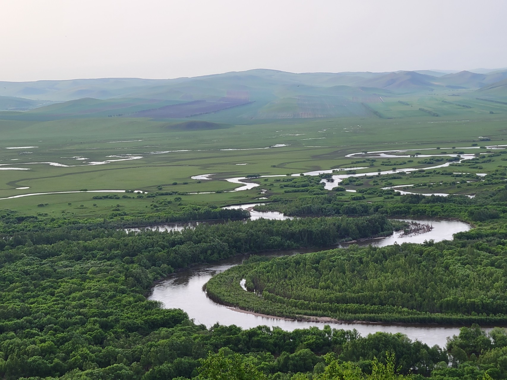

这里连个鬼影子都看不到，没有任何人来叨扰。我们独享了根河岸边的夕阳，还有渐渐变大的凉风。

要是秋天来，这里一定美爆了。

## 6月19日

来到呼伦贝尔的第二日，我们沿着根河北岸前往根河市。从额尔古纳市去往根河市有两条路，一条是新修的快速路，在根河的南岸；另外一条是老的国道线，紧贴着根河北岸。

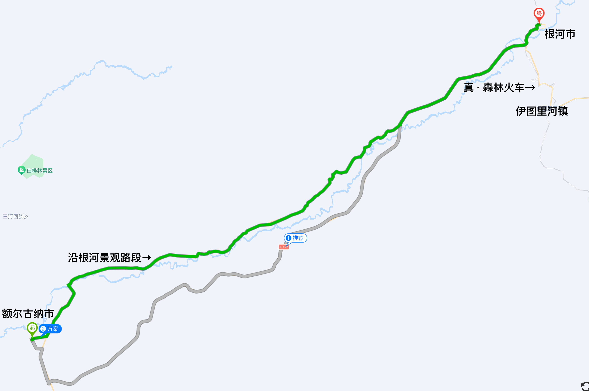

从地图上看，沿着老国道走也许能看到一些沿河风景。

然而等我们实际走下来才发现，由于北面的山坡不陡，所以沿河的公路相对河面并没有高出多少，在公路上行进的我们并没有好的视野去观景。反倒是一旦停下来开车门，各种飞虫就拼了命往车里钻。这里的飞虫又多又大，难道是寒冷的冬天使他们生命力反而变得更强大了？

> 内蒙古自治区呼伦贝尔市根河市年度平均气温-5.3℃，历史记载最低温度达-58℃（非正式气象记录），取暖期长达9个月，被誉为“中国冷极”。

接近根河市的时候，我们从一条小路到了**敖鲁古雅使鹿部落**景区。从这条小路过来不需要买莫名其妙的景区交通车票。

敖鲁古雅使鹿部落其实就是指《额尔古纳河右岸》一书中描绘的鄂温克部落，也叫**使鹿鄂温克人**（并不是所有的鄂温克人都养驯鹿）。我们来到这里最大的期待就是看看这里的博物馆，看看小说中描述的那些拗口的用具和陈设到底是长什么样子的。然而，直奔博物馆的我却看到它闭馆了。门口贴着的纸条说，博物馆从我们来的当天起闭馆改造。我心里感叹：唉，真是太倒霉了！

其实不止是博物馆闭馆令人遗憾。我还从网上了解到，小说中的主人公原型叫做**玛利亚·索**。她其实一直就生活在这个村子里，直到2022年的8月去世。也就是说，我们如果提前一年来，甚至能看到小说的主角本人。

> 玛利亚·索（1921年-2022年8月20日），内蒙古鄂温克族人，著名小说《额尔古纳河右岸》（曾获茅盾文学奖）的原型，使鹿鄂温克部落最后一任女酋长，也被誉为中国最后的女酋长。
玛利亚·索带领的敖鲁古雅使鹿鄂温克部落，一个只有200多号人的微型族群，是中国唯一饲养驯鹿的民族，被人们称为“中国最后的狩猎部落”。玛利亚·索不会说汉语，虽然她的话要通过族中其他人来翻译，但她是营地的核心和最受尊敬者。她的地位与权威，不仅因为她的年长，也来自于她以往的善于打猎和管理部落的经历。
2022年8月20日2点27分，玛利亚·索因年岁已高，各项身体机能逐渐衰竭而仙逝，享年101岁。

遗憾归遗憾，这也许是给我们留下了一个下次再来的契机吧。紧接着我们就去了人工打造的驯鹿部落公园。这个公园大约需要50元门票，性价比一般。我们买了20块一箩筐的苔藓，逗着饲养的驯鹿来抢食。小朋友因此玩得挺开心的。

离开这个公园之后，我们来到市区。然而市区停电了，饭馆全都无法营业。

此时下起了雨，我决定去**伊图里河镇**，打算先开车到伊图里河火车站，然后让其他人带着小朋友乘坐伊图里河到根河的火车，而我独自一人再把车开回根河。然而还没到伊图里河，我儿子就睡着了。因此，我就半途放弃了这个我拍脑袋想出来的“真·森林火车”计划，然后回到根河市住下。

后来，我在哔哩哔哩上看到有人坐火车经过这一段，评价这一段的风景很不错。感兴趣的朋友可以参考下面的火车班次去乘坐——这可比全国各地公园里的天价小火车划得来多了。

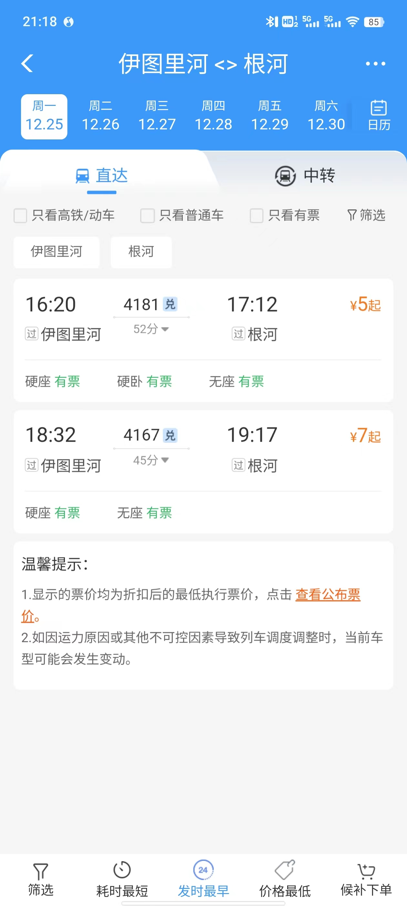

## 6月20日

来到呼伦贝尔的第三日，我们将到达这次行程最北点——**白鹿岛**。

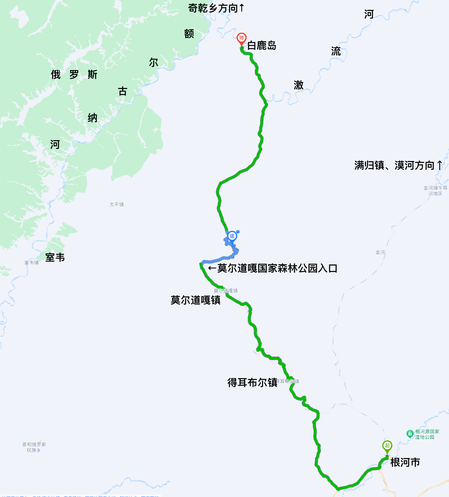

我们将一直在森林里穿梭，经过得耳布尔镇、莫尔道嘎镇，然后穿越**莫尔道嘎国家森林公园**，最后到达荒无人烟的白鹿岛。

在森林里开车，我很快就乏了。景色千篇一律，除了树还是树；经过得耳布尔镇，发现这里极为衰败和冷清；到达莫尔道嘎镇时，才终于看到了一点点生气。

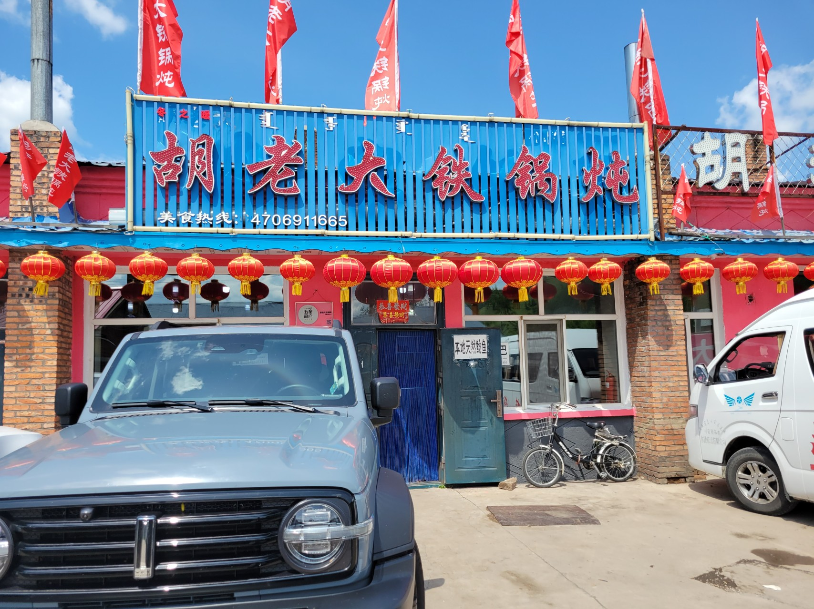

我们去一家叫做胡老大铁锅炖的店吃鱼火锅。我们都觉得这里的鱼虽然是新鲜的，腥味却特别重，好在我儿子仍然爱吃。据说，因为这里的河流水温低而且水里腐殖质比较多，所以鱼的味道就是有点腥，外地人吃不惯。

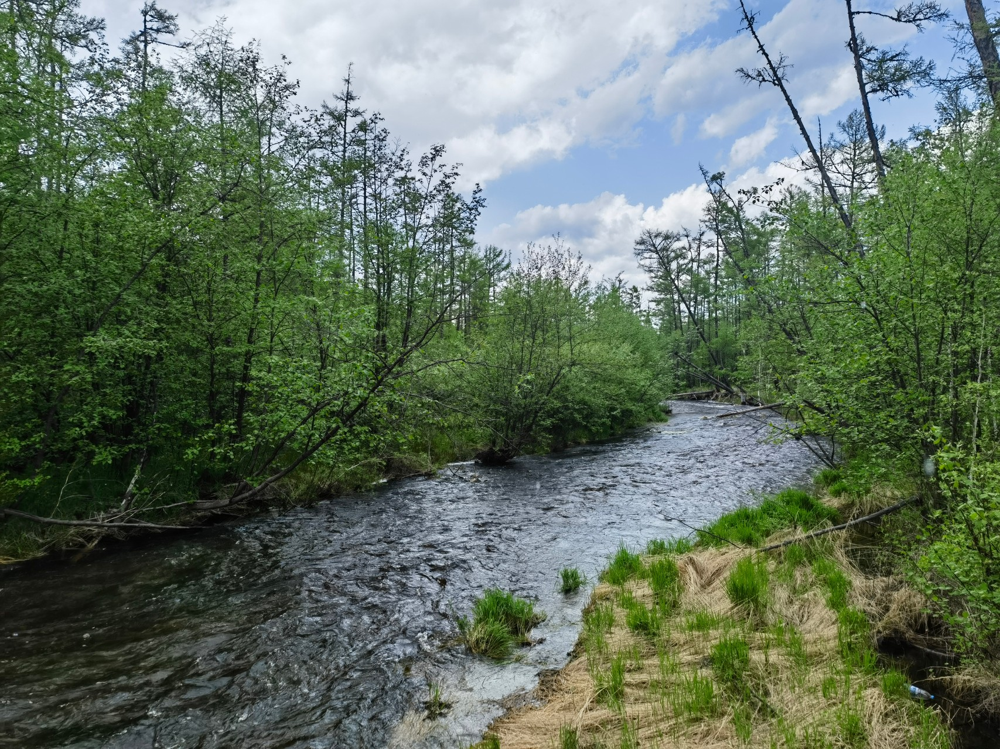

进到离镇子不远的莫尔道嘎国家森林公园之后，我果断放弃乘坐公园里开设的“森林小火车”，而是继续开车往前走。后来的情况证明这是一个英明的决定，如果我们坐了既费时间又无聊的小火车，可能就得天黑才能到达白鹿岛了。当然，我们还是顺路看了看公园里的景点，比如有个叫做**一目九岭**的观景台，可以登高望远。

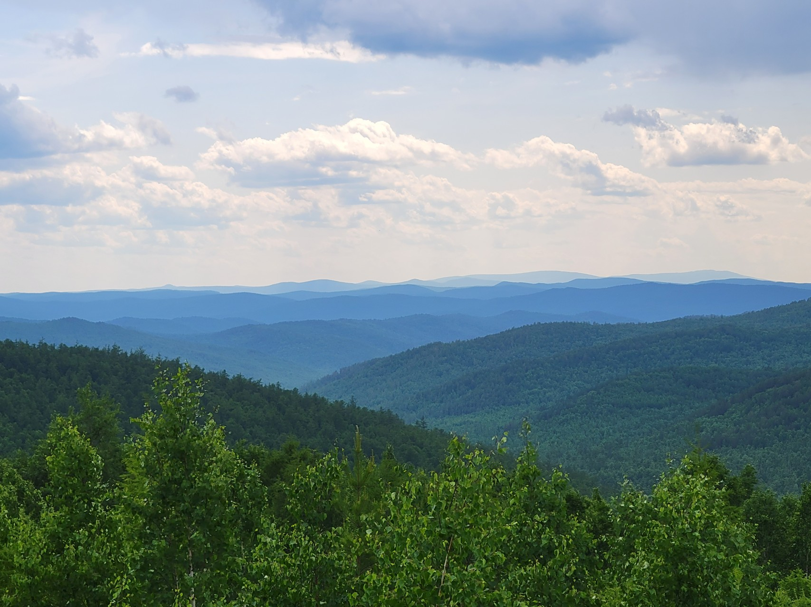

总共开了两百公里的路程，我一天下来都没看到几辆车。这里已经是大兴安岭的深处了，越往北走，路上的房子也越少。我发现路上没有手机信号，而地图导航又把酒店标错了位置，以至于我都有点担忧今天晚上是否能顺利安顿下来了。直到终于找到白鹿岛大酒店——方圆五十公里唯一的酒店，可能也是唯一像样的房子，我们悬着的心才放了下来。

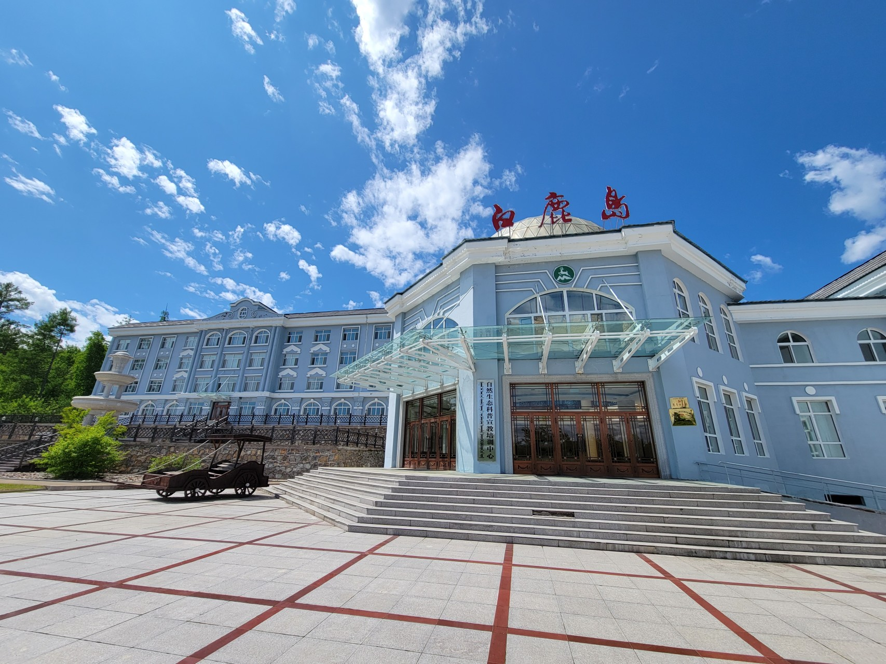

在酒店放下行李之后，趁着还没天黑，我们马上去了离酒店不远的白鹿岛观景台。

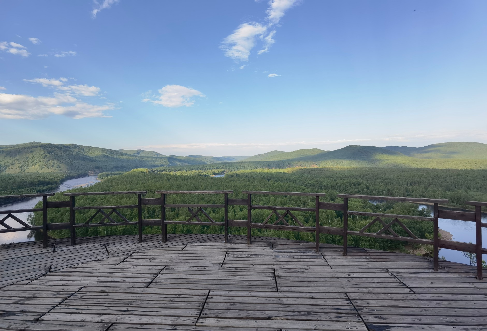

白鹿岛其实不是一个岛，而是一处河湾而已。

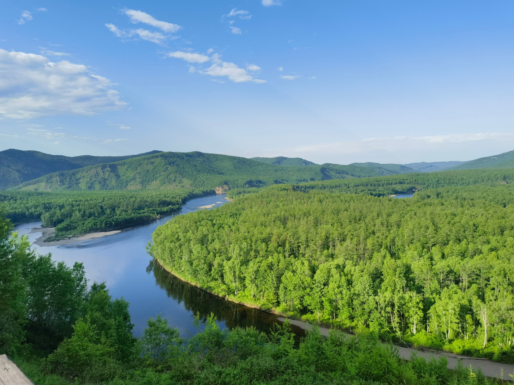

这条河叫做**激流河**，是敖鲁古雅鄂温克部落的母亲河。他们一百年前就是从激流河河口的奇乾乡顺流而上，然后繁衍在广袤的大兴安岭森林里的。

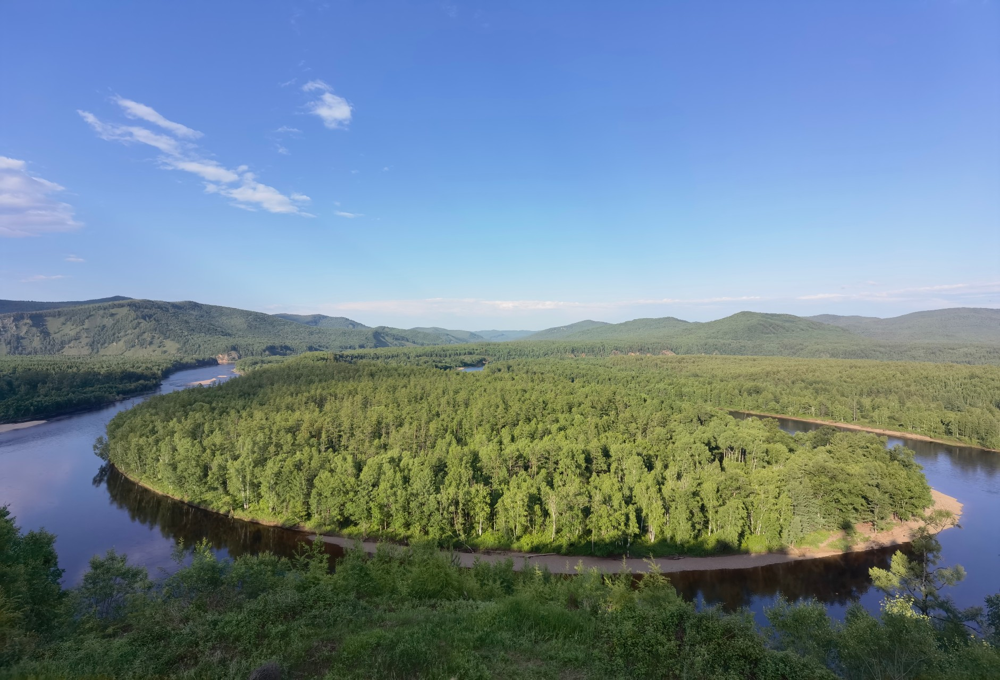

观景台的背后有一处铁塔，我在网上看到有人爬上去过。

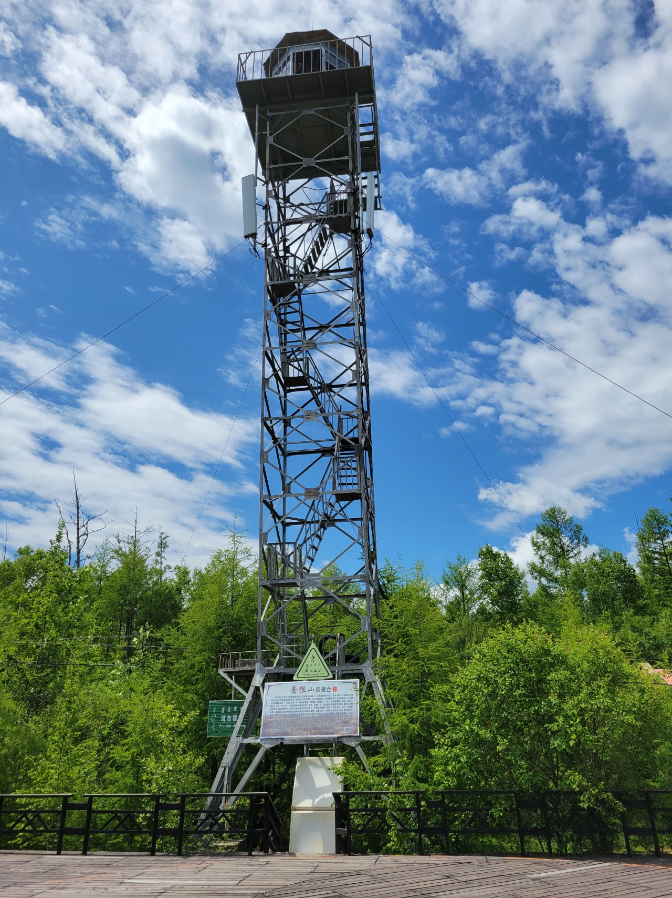

然而，我看到的铁塔却是封锁了入口的。

我决定还是要爬上去看看，于是想尽办法扭动身体穿过了封锁。但向上爬到一半我才发现这个铁塔确实应该封锁起来，因为它有很多台阶都是镂空的，一边爬一边能看到脚下的地面，万一踩空后果不堪设想。它根本不是给游客用来观景的，而应该是给森林防火员用来瞭望的。我双手丝毫不敢放松，战战兢兢地爬到了顶端。果然，铁塔顶端能更好地欣赏激流河和白鹿岛的形态。

<video src="./photos/白鹿岛铁塔顶端风景.mp4" width="auto" controls></video>

往各个方向上拍了拍照，我不敢久留，又战战兢兢地爬到了地面。这时已近天黑，我们很快回到了酒店。

此时还没到暑假，酒店很空，房费不高。房间内设施也还不错，窗外景观更是像仙境一般，所以我很推荐这家酒店。这里真的算是世外桃源了：除了酒店的工作人员，根本就没人。

## 6月21日

在白鹿岛的第二日上午，我们去玩了激流河漂流。这是酒店配套的旅游项目，号称“北国第一漂”。由于水流较缓，没啥刺激性。

我们还去了北边的激流河大桥，桥的前面立了块牌子，说是此桥不通，想去奇乾乡的车辆需要绕道漠河——可是我估计绕这么一下需要至少3天！偶尔有车经过，好像没有哪辆车在乎这座桥是危桥。希望G331早日全线通车，它会成为一条紧贴中国北方边境线的景观公路。

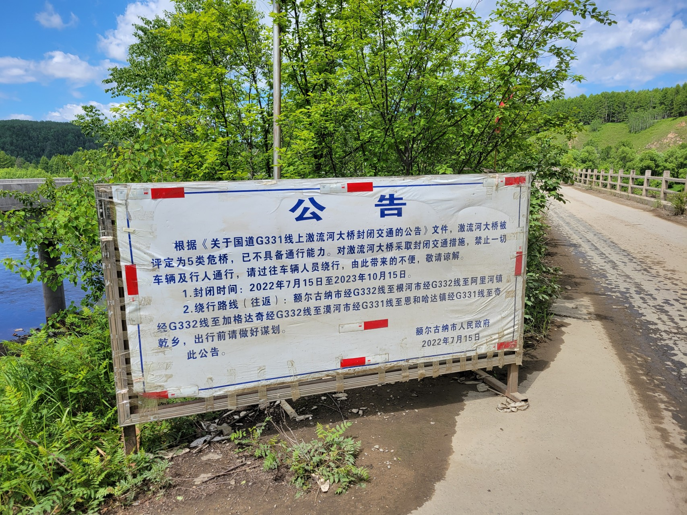

我们也就此打住，不再继续往北。这个桥的位置就是我们这次行程最最最北点了。

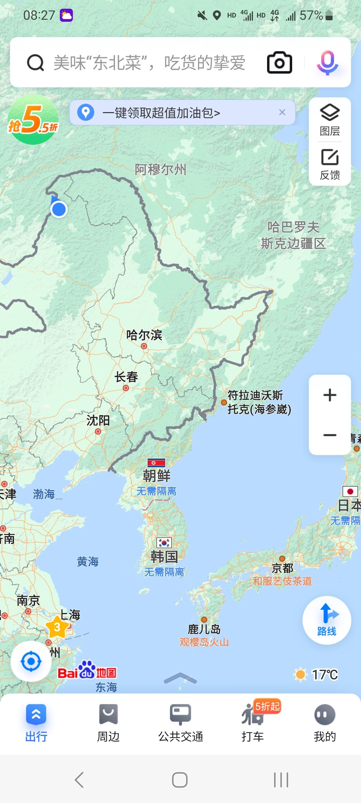

有趣的是，这里在我家的正北方向2000公里的位置，这里和我家都在东经120度50分的经线上。虽然这里不如中国最北的地方——漠河市靠北，但是整个中国也只有漠河市和塔河县比这里更靠北了。

中午，我们在酒店吃完午饭，驱车前往临江屯。一路上我们看到的又是重复不断的森林，好在刚铺设完成的这段331国道减少了一些路程。

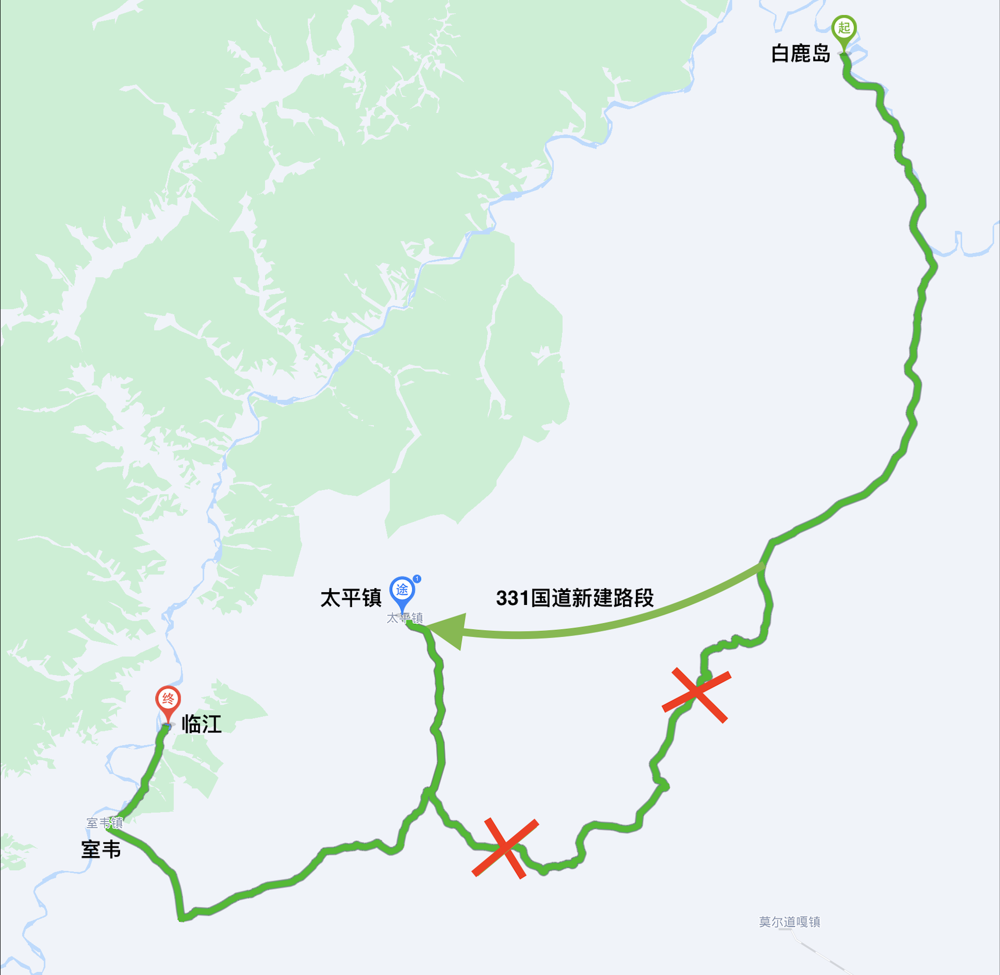

从太平镇到临江屯的小路不通，于是我们只能绕道室韦镇，然后沿着额尔古纳河往北到达临江屯。

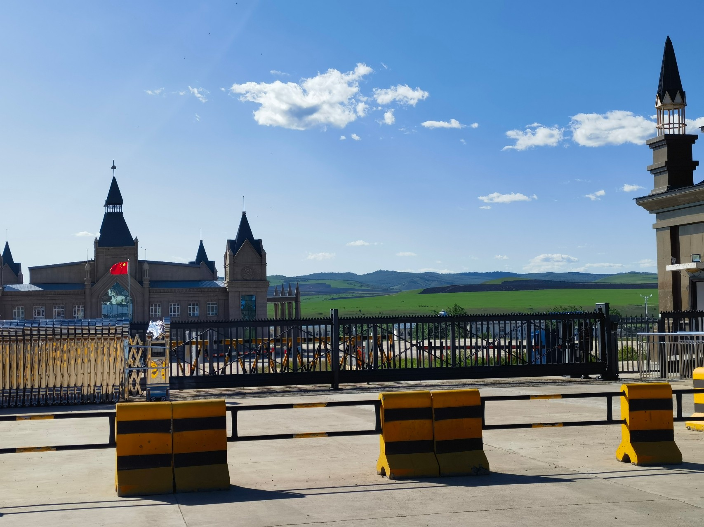

这是我们第一次看到额尔古纳河的真容，也是第一次看到俄罗斯的真容。

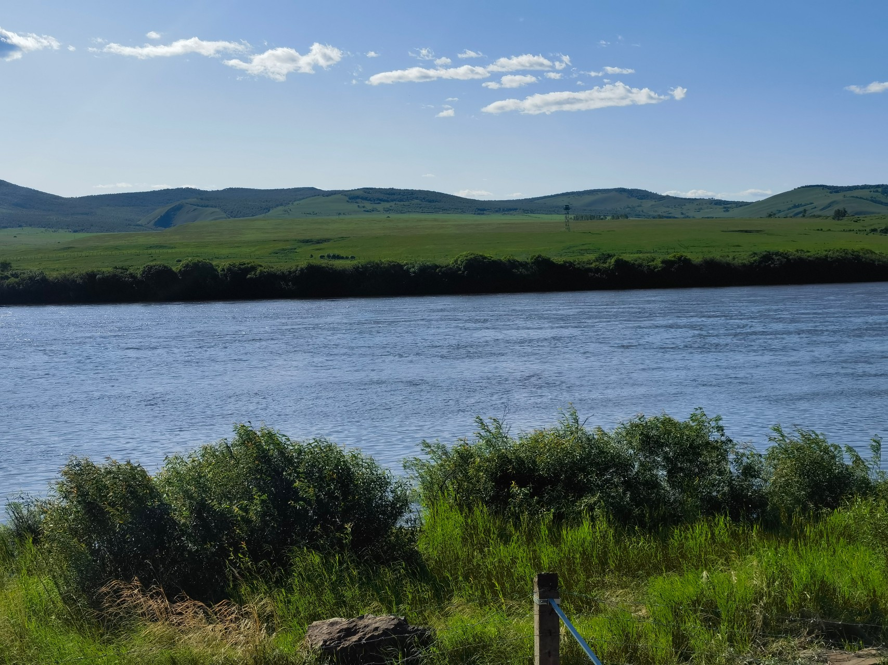

晚上，我本来带着儿子打算看银河的。他从出生到现在还不知道银河有多壮丽，所以只要是到了远离城市的地方，我都会想着带他看银河。然而，我显然失算了。现在是夏至日，一年中光污染最严重的日子。这里直到晚上9点天还是亮的，晚上11点北方的天空还泛着红色。也许只有午夜12点天才能完全黑下来——然后1点钟天又亮了。民宿的老板说了，要8月份来看银河。

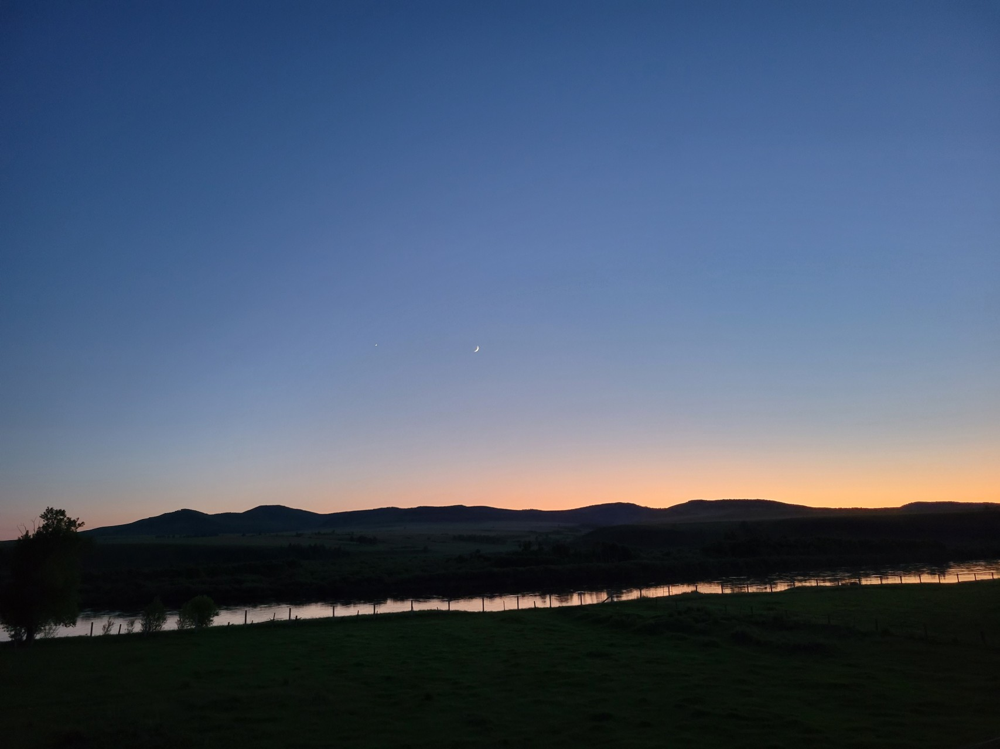

## 6月22日

我们将继续往回走，这一日的目的地是黑山头。我们将沿着额尔古纳河边的室韦-九卡-七卡-五卡这一线，一路向南。这里的“卡”字应当是指哨卡。

一路上景色单调，只有重复的河流、草原、麦田。好在我们开着越野车爬上了一些山头，算是找了点刺激。现在，我只记得这一路上最漂亮的景色大约出现在五卡附近。

这条著名的“卡线”有点让我失望。也许是因为我们没有去参与那些滑草、骑马之类的娱乐项目吧。

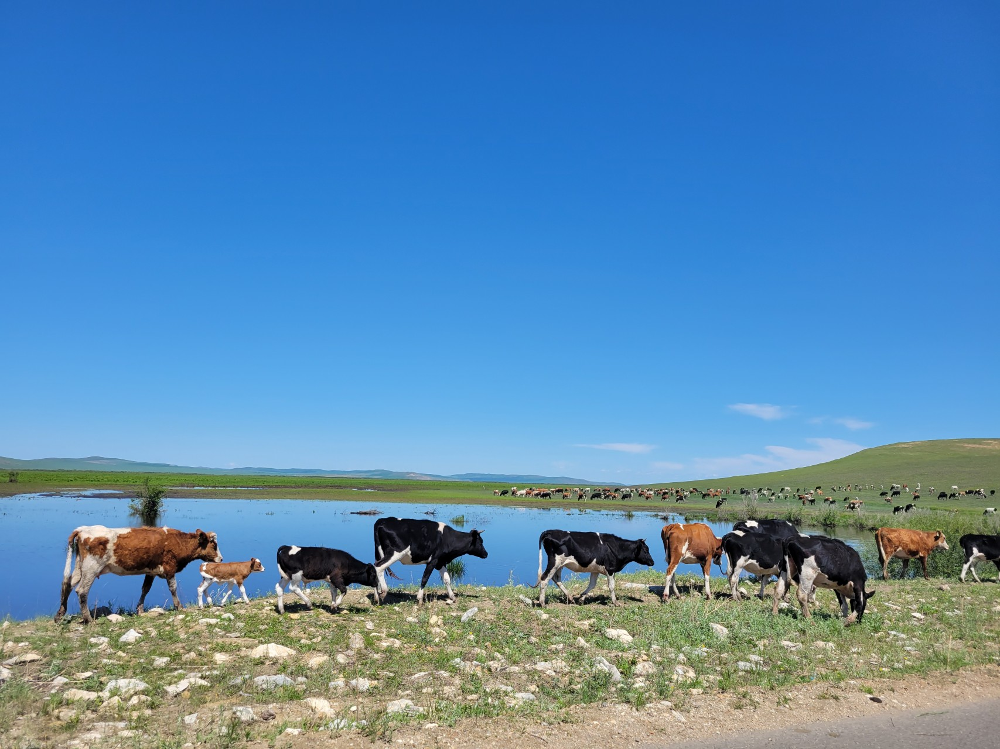

下午，到了黑山头的酒店之后，我身体不适，就一直在床上躺着了。好在酒店的条件还可以，家里其他人在酒店内部玩也挺开心的。这家酒店叫做列夫湿地庄园酒店；我在网上订不到它的房间，最后是找租车公司的小哥帮忙预定的。

## 6月23日

最后一日，因为身体不适变得更严重了，我放弃了计划中的边境公路之行，开车直奔呼伦贝尔市区而去。

下午，我们从呼伦贝尔机场飞往南京，然后转火车回家，结束了这次东北之旅。

## 结束语

总体而言，呼伦贝尔久负盛名，但它的风景略低于我的预期。以后，我可能会选择在某个九月再次来到这里，可能会再去一次额尔古纳市的根河湿地，可能会去走一下中俄边境公路，更可能会去大兴安岭的另外一头——阿尔山。到那时，这里将是一篇金黄色的海洋。