十一月中旬，我决定把今年的年假用完，于是带着父母和儿子去了一趟云南。我们选择了云南最南部的西双版纳和最北部的丽江香格里拉这两块相隔500公里的地方一次性游完。

这个时候，云南的最南部（西双版纳）刚刚才进入旱季，雨水变少，气温变低。但是，比起北回归线以北的广大地区，这里仍然十分温暖。云南的最北部（香格里拉、丽江）则开始进入深秋季节，白天阳光普照，体感舒适，而晚上则接近零度，需要注意保暖。

## 11月18日

周六下午，我带着儿子从苏州出发；我父母则在老家，从衡阳机场出发，到达西双版纳。

有意思的是，我们乘坐的是同一次航班九元航空AQ1624，同时到达西双版纳机场。这次航班从无锡机场起飞，经停衡阳机场，最后到达西双版纳。我父母并不知道我和儿子会在衡阳机场同他们碰头，所以算是给了他们一个小小的惊喜。

抵达西双版纳机场已是晚上十点，我选择了机场附近一家酒店就近休息。这个季节的西双版纳可能是旅游淡季，酒店非常便宜，花300元住的两间房间空间很大，条件还不错。

## 11月19日

一早吃完早饭，我在酒店门口和租车公司办完了租车手续。我租的是红旗E-QM5，一辆中大型纯电轿车，**总价190元3天**，便宜到有点夸张的程度！我妈妈一坐上后排，就说这比暑假花了400块一天租的沃尔沃S90坐着更舒服一些。

后来，我通过网上了解才知道，这款车在一汽红旗的大本营吉林省长春市上牌的话，**裸车价只需要8.8万**！所以，在全国各地大街上能遇到的黑色红旗E-QM5大多数都是挂的吉A牌照。

上午，我们驱车将近两个小时来到**勐远仙境**景区。这个景区地处偏僻，几乎没有旅游团光顾，特色是“雨林穿越”。这里的门票大小同价，4个人大约1000元，真不便宜。但是因为这种沉浸式的体验具有不可替代性，所以我还是选择到西双版纳的第一站就来这里。

我们四个人由一位外号叫做“菠萝”的导游带队，乘坐一小段电瓶车之后，出发深入探索位于西双版纳自治州勐腊县勐远乡的这处深山雨林——好吧，其实这都是景区的固定路线。

刚一开始走在景区的步道上，我们就陶醉在两侧高大浓密的植被里。

导游不断地给我们介绍各种植物和虫子。

我们看到了橡胶树和芭蕉树，知道了芭蕉树上的花是可以当蔬菜吃的。

我们看到了蚂蚁会把裂开的叶子缝起来。

我们看到了只在书上见过的树枝虫。

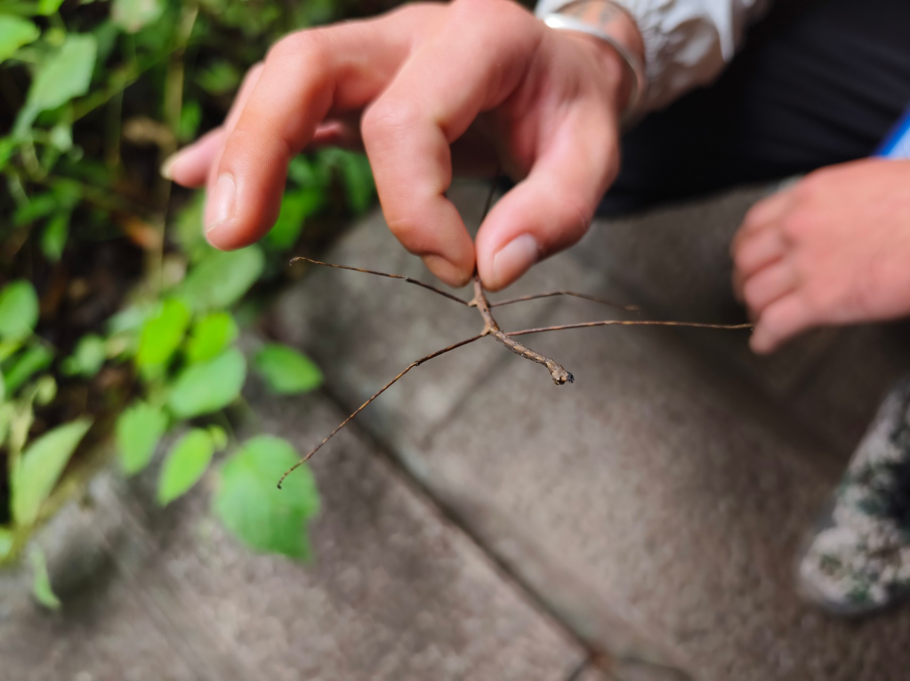

在到达一处千年绞杀榕之后，我们离开“铺装路面”，开始行走在密林里的土路上。

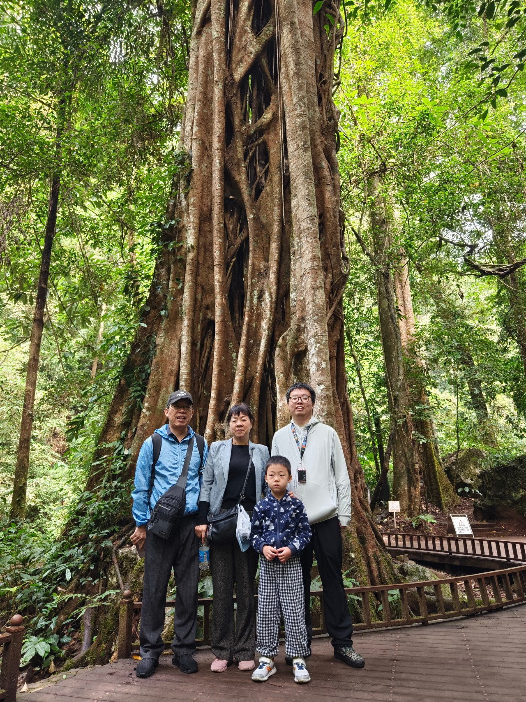

遗憾的是，我们一路上只看到虫子，没有看到蛇。按照导游的叙述，前两天还在路边的树上看到了竹叶青。导游说，竹叶青是懒蛇，人不攻击它它是不会攻击人的，所以比较安全。

我们一路往前走，路变得越来越艰难。有许多大树三年前刚刚倒下，挡住了一部分小道。导游在前面牵着我儿子走，看起来很有带小朋友的经验，让人很放心。

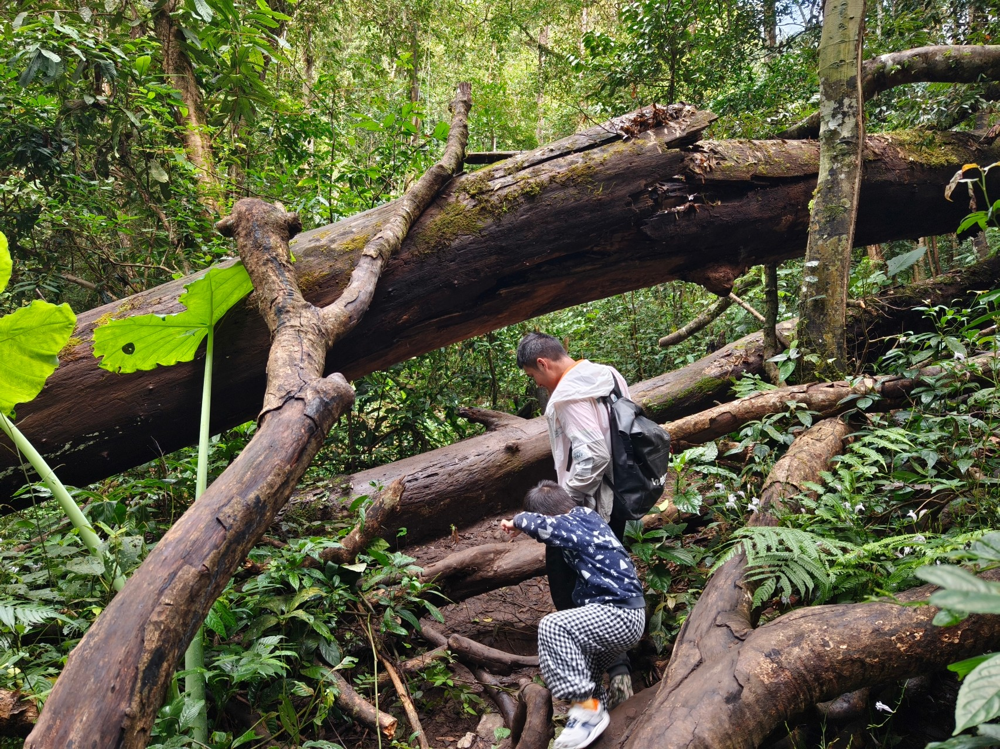

此时，开始有了一点点太阳光照射进密林里。我意识到自己已经浸泡在绿色的海洋里了，感觉呼吸畅快了不少。

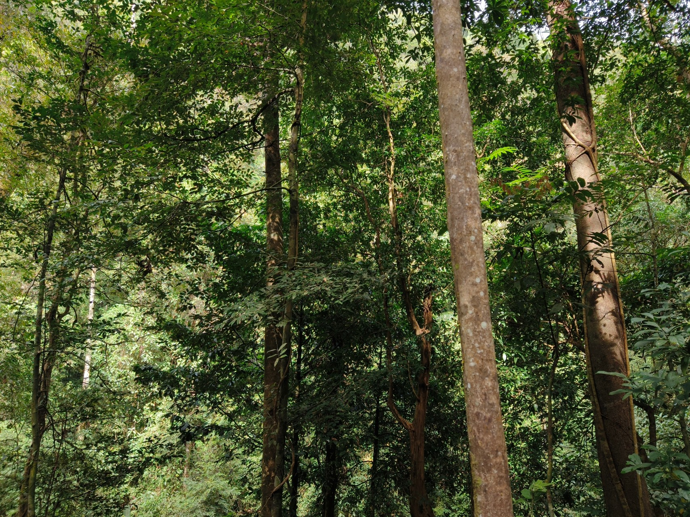

最终我们达到一处河岸边，便不能往前走了。按照景区的固定路线，之后我们要从这里折返，溯溪而下。

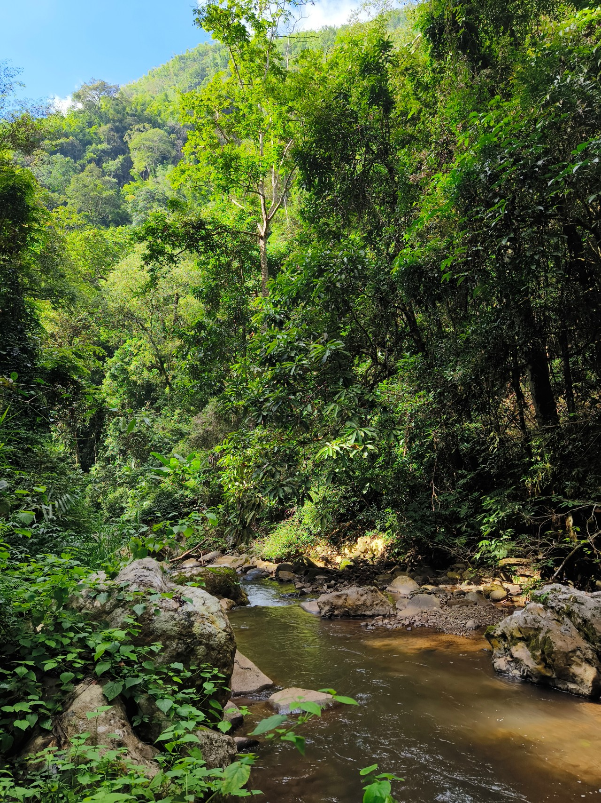

导游带着小朋友在河里摸鱼，抓树蛙，还有荡秋千。小朋友对于他可以毫无顾忌地在河里踩水这件事情感到很兴奋。但穿着鞋子踩在水里的我感觉水还是微微有点凉。

接下来溯溪而下的时候，我们要反复穿越河流。水流的最深处没及膝盖，我们需要手拉手通过，否则有滑倒的危险。

在一处树下的河水里，导游发现一条手掌那么长的毛毛虫。他说这是野生的蚕，我们盯着看了好久。最后导游把它捞回到树上，说是在水里这条蚕肯定会活不下去的。

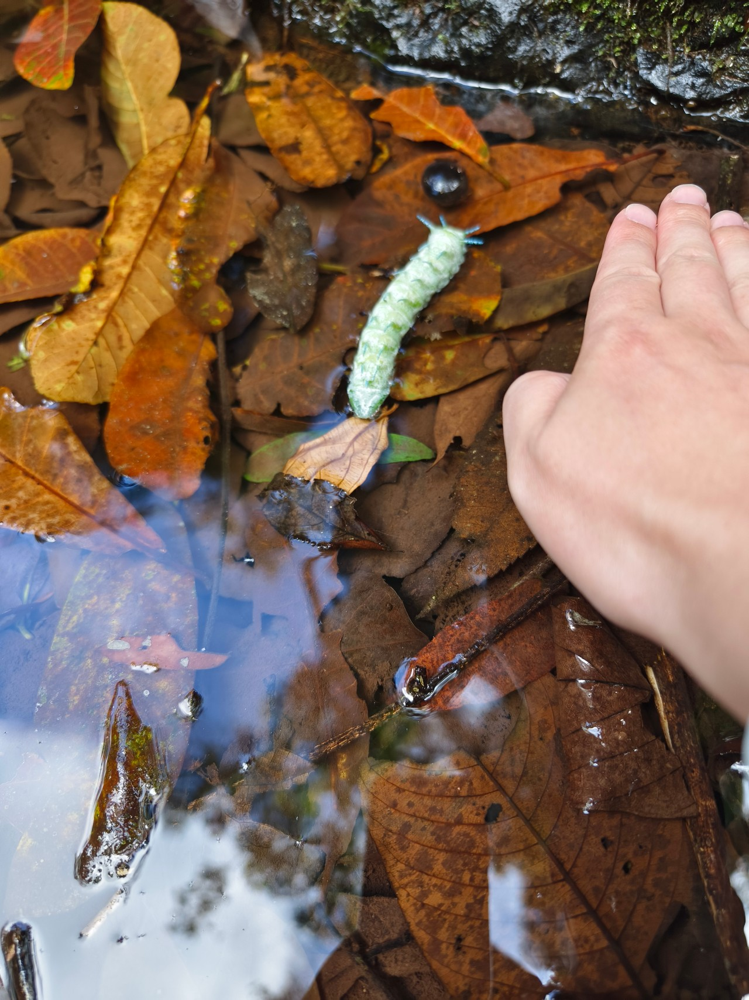

历经三个多小时的穿越，我们最终回到了景区大门口。景区提供姜茶给游客驱寒，还给小朋友发放了一张“志愿者服务证书”。

这趟旅程我感觉总体还是值得的。这个季节能看到的野生动物确实不多，算是小小的遗憾——也许以后我们还会在暑假的时候再来一次。

下午，我们驱车到达**勐腊**县城。此时还是四点左右，饭馆还没有晚饭吃。办理酒店的入住手续之后，我们开始寻找农贸市场。农贸市场现在几乎是我们每到一个地方必逛的“旅游景点”了，因为往往这里有在其他地方看不到的各种土产和食物。

最终，我们找到一处“下午市场”，在这里买了许多水果，包括一种从来没见过的土产浆果，形状像蓝莓，但其花青素含量号称是蓝莓的数倍。我已经不记得它的名字了。

## 11月20日

第二天，我们计划去勐腊县东北方向半个小时车程的**望天树**景区游览。由于摸不准景区的情况，我们从酒店老板那里花每人140元购买了望天树景区所谓的“水-陆-空”套票，价格比携程上便宜20元一人。

景区的路线是先到达一个码头之后，停好车，乘船游览一段澜沧江的支流——南腊河。我感觉这段乘船的行程其实乏善可陈，河两岸都是普普通通的森林景观。抵达终点码头下船之后，我们才算是到达了景区真正的大门口。

刚一进到大门口，小朋友就被一些科普性的展板留住了脚步。

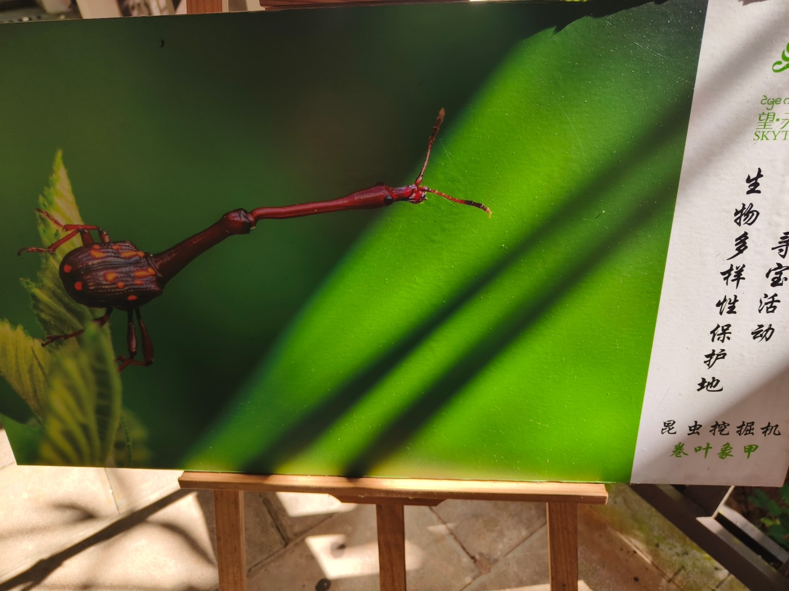

一见到展板上的“兰花螳螂”，我儿子就说这是兰花。他还不认识兰花这俩字，估计是他的姥姥给他看过兰花的样子。

由于没有请导游，进到入口这段路上的各种植物我们都只是走马观花看了一下。然后，我们到达这个景区的标志性景观“树冠走廊”——这就是景区所谓的空中部分。景区搭建了一系列高空吊桥，这些吊桥的两端栓在几十米高的望天树的腰部。游客需要从几十米高的吊桥上走过。

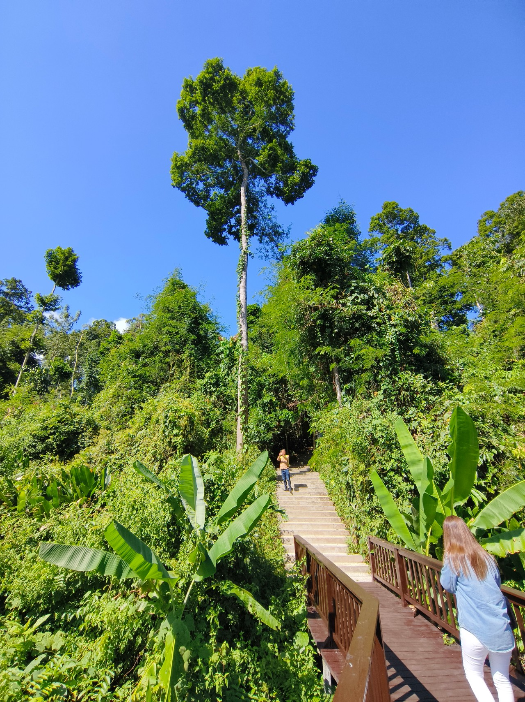

我走完这一系列吊桥之后，感觉惊险有余，景色不足。所以，望天树景区所谓的“水-陆-空”三维景观，“水”和“空”的部分我都不是很推荐。而公园本身的大门票只需要55元，这55元才是真正值得花的。毕竟，望天树景区里有中国第二高的树，高达80多米。而它第一高树的名头可能还是最近两年才被墨脱发现的那棵树给夺走的。

之后，我儿子还在这里荡了可能是中国最高的树上秋千。他玩了不止半个小时才舍得离开这个巨型秋千。

出了景区之后，傍晚，我们在勐腊县城一家湘菜馆吃饭。通过饭店老板才知道勐腊县这里的一多半外地人都来自湖南省祁东县。祁东县和我的老家都同样属于衡阳市。算起来，这云南最南边的一个县居然到处都是我的老乡。吃完晚饭后，我们连夜赶往了勐仑镇。这个镇上有西双版纳最受欢迎的景点——**中科院热带植物园**。果不其然的是，晚上我们入住的酒店老板也还是祁东县人。

## 11月21日

我们吃完早饭就进入到中科院热带植物园景区里。即便是淡季，这个景区大门口还是乌泱乌泱挤满了人，远远多过了前两天我们去的那两个景区。一方面是因为这里是西双版纳的招牌，也即唯一的5A景点；另一方面是因为这里离西双版纳的景洪市区比较近，从市区一日往返比较方便。

进入景区大门后，我们乘坐了很长一段电瓶车。整个景区分为东西两部分，一般游客只游览西区部分。我们的电瓶车在西区的最东面停了下来。

我们先去寻找王莲，这是一种据说可以让一个小孩坐在上面而不下沉的巨型莲叶。路上我们看到了鞭炮花。

等到了王莲池子边，却看到王莲都不大。景区的工作人员说，现在这个季节王莲已经枯萎了，无法坐人上去了。我非常遗憾，这王莲可是景区的招牌景观。中科院热带植物园在夏季还可以看萤火虫，现在也是过了季节的。看来，现在其实并不是来西双版纳旅游的最佳季节，我失算了。

我们只能接着逛。无论如何，这里是中国植物种类最多的植物园了，一定会有很多新奇的植物等着我们去参观。

果不其然，我们看到了叶子像仙人掌的树。

还看到了几十种吃虫子的草。

以及各种仙人掌、仙人柱、仙人球。

还有红毛毛球花（不记得学名了）。

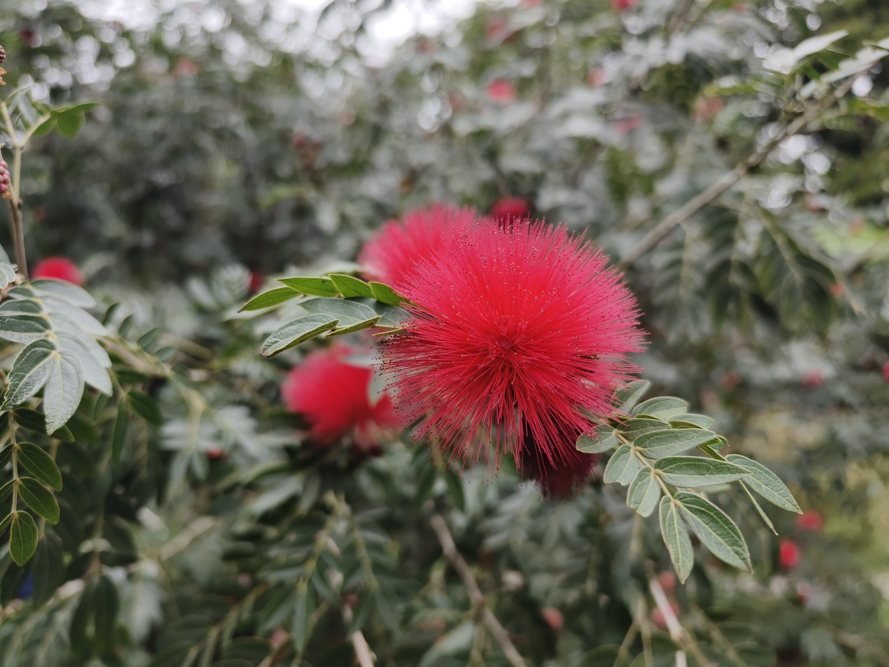

还有疣柄魔芋（让人想起尸香魔芋这个名字）。

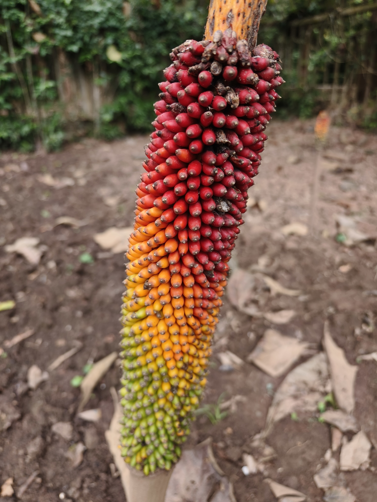

还有木瓜、

可可、

菠萝蜜等等只吃过却没见过长在树上的样子的果子。

还有一种叫日轮玉的长得像蘑菇的多肉植物。

景区非常大。我们逛了好几个小时，实在是走不动了。最后逛了下景区里的一个博物馆，然后决定离开。博物馆里有一种**轻木**制成的树桩子，比重只有水的十分之一，小朋友也能轻松抱起来。

出了景区之后，我们照例还去逛了逛勐仑镇的农贸市场，没有啥收获。最后，我们赶往景洪市区。晚上，我们住在**西双版纳蔚景温德姆酒店**。可惜的是，这家酒店又贵又垃圾，各方面设施都烂透了。建议看到我这篇文章的游客一定要避雷。

## 11月22日

早上我们把车还了，然后打车去景洪市区的**曼听公园**。这座公园据说兼有民族风情的建筑和热带森林景观，旁边还有一个南传佛教寺庙**总佛寺**。

然而，我逛下来之后觉得除了公园的湖中有鸳鸯和天鹅可以逗着玩之外，其他方面意思都不大。

我们在公园里也看到了大象，然而并没有大象表演，只有大象科普。小朋友对大象的出现也只有一般般的热情。

总之，这个公园只能算是个普通的市民公园，并没有不可替代性。

吃完午饭，我们从酒店收拾东西然后打车去了机场。下午，我们乘坐西双版纳至丽江的飞机到达丽江。飞机从起飞到落地只经历了不到一个小时。

晚上，我们住在**丽江官房大酒店**的亲子房，性价比很高。这家酒店是丽江市区的最高建筑，房间内景观也很不错。吃完晚饭，我又在酒店门口办完了租车手续。这次，我们又租了一辆坦克300，三天的租车总价400元出头。

## 11月23日

早晨拉开房间的窗帘，我们看到了日照**玉龙雪山**。没有那么惊艳，但站在温暖的房间里就能看到雪山的感觉还是很爽的！

上午，我们驱车前往**虎跳峡**。我们的车开到拉市海附近就胎压报警了，但是轮胎看起来又没啥问题。看来长城的车质量跟沃尔沃一样不靠谱。我们最终只能无视警告继续往前开。

中午，我们买了虎跳峡景区的门票，然后找了家饭馆吃过饭，再把车停在了**上虎跳**景区的停车场，开始徒步往峡谷底部走。上虎跳需要下降的高度并不是很高，老人小孩也都能吃得消。

这次，我们看到的是清水的金沙江。我上次来虎跳峡，是在七年前的六月份带着妻子来的，看到的是浑水的金沙江。我还是更喜欢现在这个季节来到这里。因为这个季节天气晴朗，光照充足，游客能清楚地看到金沙江两岸高耸的雪山。由于有**可能高达2000多米**的垂直高差，在峡谷底部看对岸的高山山顶感觉非常震撼！

逛了上虎跳景区一两个小时后，我们继续驱车沿着金沙江往下游走，一路上的峡谷风光很不错，尤其是夏天看到了浑黄的长江三峡之后，再看碧玉色的金沙江，感觉还是清水峡谷更漂亮。

**中虎跳**据说很好玩，而且也没有门票，只收一点点卫生费。可惜中虎跳需要下降的高度太高了，我们老人小孩旅游团的体力不足以支撑下到谷底再爬上来，只得放弃。如果是年轻人来玩，完全可以略过上虎跳，只来中虎跳。如果装作本地人路过，还不用买上虎跳的门票。

下午我开车一路经过**哈巴雪山**观景台，抵达了位于香格里拉市**三坝乡**附近的宾馆。

## 11月24日

三坝乡位于香格里拉市的“东环线”旁。东环线是一条在2023年才刚刚修整好的旅游公路，它从虎跳峡到香格里拉市，却不与丽香高速平行，而是绕道哈巴雪山的东侧，经过的最大的景点就是**白水台**。

早晨，我们花了二十分钟爬上白水台，阳光照射在钙化池水面上，太惊艳了！这是无法用相机拍下来的惊艳。

虽然我去过**黄龙**两次，但是仍然认为白水台的钙化池景色绝不输于黄龙——大名鼎鼎黄龙可是我国最早的一批世界自然遗产。

白水台的步道设计很合理，游客可以踩着石块深入钙化池的中央。我儿子一开始不肯爬上来，被我逼着爬上来之后却也说**这里太美了**，他站在池子中央玩水玩得不亦乐乎。

顾名思义，白水台的池堤其实是白色的，相比于黄龙的黄色池堤，看上去更为圣洁。秋天的红叶，也为这里增添了丰富的色彩。

我们还摸了摸池子当中已经被碳酸钙包裹的水生植物。

在抵达**神泉**之后，我们开始往下走。在下山的步道旁边，同样有惊艳的大面积钙化池台阶。

白水台景区不大，但是我们仍然玩了两个多小时才出来。我想，如果我下次再来，我可能会带上吃的，再带上一本书，然后在这景区里呆上一整天，观察观察从早到晚随着光影变化而产生的不同景色。

这个景区也最终毫无悬念地成为了我们这次云南之行的MVP景点。它的海拔只有不到2500米，相比黄龙高达3500的海拔，对我们这些来自低海拔地区的游客要友好很多。它的面积远小于黄龙，对游客的体力要求却也同样远小于黄龙。我在上一次来云南的时候就已经听闻白水台的大名，但因为路途遥远并没有来这里。由于东环线已经修整完工，它会逐渐被游客所认识和喜欢。但是值得注意的是，如果天气阴沉没有阳光的话，这里的景色很可能大打折扣。景区的管理也不是很好，登山路上挤满了骑马拉客的当地人，让人颇为烦躁。

中午，我们沿着东环线继续向北走。一路上海拔越来越高，以至于路面甚至有了积冰，导致我们的车一度打滑。

恰好昨晚香格里拉大部分地区都下雪了，而一旦在路上见到雪，小朋友就兴奋得一定要下车去打雪仗。

走走停停，我们经过的下一个景点会是**普达措**公园。普达措公园号称“普达措国家公园”，对于“国家公园”这个称号我是不太买账的。它票价较贵，而网上评价却并不高。我知道的是，它的主要景观包括两个高原湖泊，一曰属都湖，二曰碧塔海。其中，碧塔海的评价略高于属都湖。除此之外，也就是一些普普通通的高原草甸、灌木景观。而且我又提前从网上得知，景区因为环境保护之类的原因关闭了通往碧塔海的木栈道，却并没有相应调低票价，所以我根本不打算买票进到这个景区里。

但在做这次行程准备的时候，我研究了卫星地图。我发现有一条小路其实可以不从景区大门走却通往了碧塔海的南侧。这个小路的入口就在东环线上，在下图中**罗光洛**这个位置。按照计划，我将开着我们的越野车探一探这条路的虚实。

快要到达这个小路路口位置的时候，我赫然看到了一块路牌，上面写着**碧塔海南线**。这一方面坐实了我的发现，另一方面却让我觉得有些失望，因为它意味着我的发现并不是一个“发现”，而是广而告之的信息。任何路过这里的自驾游客，都可能从因为看到碧塔海南线的牌子，而临时起意去这条小路上一探这已经封闭了的碧塔海。

索性的是，刚从这条小路进去走了五十米，我们就发现小路被拦起来了。有专人守在栏杆旁边的房子里。这里正是普达措保护区的南大门，游客是肯定不让进去的。我跟守在这间房子里的工作人员聊了聊闲话，然后跟儿子又打了打雪仗，继续往香格里拉市区方向开去。

到达香格里拉市区之后，我们没有停留，而是前往**纳帕海**环绕一圈。纳帕海不需要门票，被人戏称为“那破海”。但这个季节纳帕海很漂亮，水面如镜。

而且因为水位低露出滩底，有好多好多鸟类在这里栖息。

小朋友看各种鸟儿看得一直不肯走，以至于我们回到香格里拉市区时已经接近傍晚5点了。

在吃晚饭前，我想顺便去看看**松赞林寺**。七年前，我和妻子曾经从后门逃票潜入到松赞林寺景区里游玩，却也觉得，这寺庙只从外面看看还可以，里面平平无奇。但这次，我们发现在香格里拉市区里连远观松赞林寺都做不到，因为景区在很远就做了围挡。

于是，我们直接去了**独克宗古城**吃晚饭。虽然也算是在景区，但土鸡火锅仍然很实惠，100多一点点的价格就让大家吃得很饱了。我仍然念念不忘和妻子在独克宗古城里吃到过的土鸡火锅的味道，这次吃的火锅显然还是赶不上那个味道的水平。

吃完饭，我们一路驱车沿着丽香高速公路抵达虎跳峡镇的宾馆。因为时间原因，我们不继续往北去德钦县看梅里雪山了——我有点小小的遗憾，七年前因为天气不给力没看到梅里雪山，而今肯定能看到它的真容却又因为总体时间不够只得放弃。

虽然已经天黑，我们也不选择在香格里拉市区住，因为这里海拔高于3000米，天气寒冷，易发高原反应。我们只需要从香格里拉市区往南行车一个小时多一点，就能到达海拔不到2000米的虎跳峡镇住宿——这个海拔绝不会引起高原反应。

## 11月25日

这是我们在云南游玩的最后一天了，我们将重走虎跳峡，在下虎跳附近的**大具乡**过金沙江大桥，而后往南翻越垭口，从玉龙雪山景区北门进入景区，最后自驾穿越景区回到丽江市区。这意味着这三天我们在丽江和香格里拉之间走了一个8字形，而虎跳峡这段路就是8字的腰部。

在第二次走虎跳峡这段路上，我们看到了对面山顶的七彩祥云。看来七彩云南的名号诚不欺我。

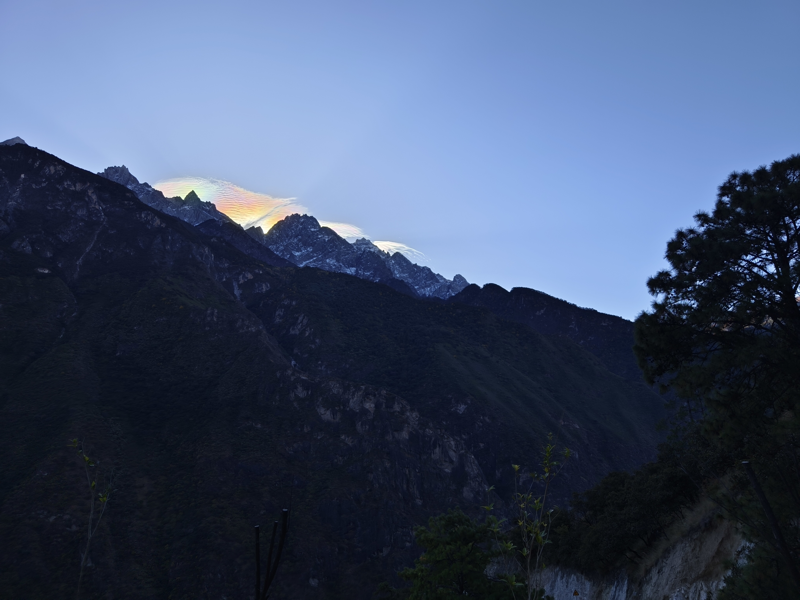

我们还看到了幽深的**下虎跳**。

经过大具乡之后，我们的车走了近一个小时的盘山路才到达了玉龙雪山景区北门。虽然我们的车是丽江本地车牌，但是我无法让工作人员相信我是丽江本地人，所以不得不买了两张半“进山费”门票才能通过，一共250元。如果我提前准备，让我在丽江的同学或者租车公司帮我伪装成丽江本地人，也许就可以不用掏这所谓的“进山费”了。

进了景区之后，我们决定去坐牦牛坪索道。坐上索道后，我们一路往雪山高处行进，因为山体离得近而感觉有些小震撼。上到牦牛坪后，我发现这里并不平，而是需要走很长一段缓坡栈道才能到达牦牛坪的尽头。

这段栈道有点坑，我们耗费了总共两个小时爬这段高海拔的栈道，却并没有看到什么惊艳的风景。回到牦牛坪索道下方，已经是下午三点多。等到我们到达蓝月谷时，太阳已经西斜。蓝月谷的一串湖泊已经部分被山体挡住了阳光，看向玉龙雪山方向也已经严重背光了。

因为我儿子已经在车上睡着了，我们没有在蓝月谷过多停留，直接赶往了丽江市区吃晚饭。

事后总结下来，从北门进入景区之后，我们应该先直接前往蓝月谷，而后去玉龙雪山大索道那边碰碰运气，看能不能买到大索道的票直接乘索道上到玉龙雪山4500多米海拔的打卡点游玩。而前一夜由于开夜车我没有来得及在微信公众号上抢到大索道的票，是导致我们最后一天玩得不够尽兴的直接原因。

晚上，我们在丽江火车站归还了坦克300，并且坐上了Y754次列车前往昆明，我们将在第二天上午从昆明换乘飞机回家。Y754次列车是一趟特色旅游列车，我把它当做一个打卡体验加入了我们的行程。它有全国独一无二的**一人软卧**包厢，这个包厢里有一张1米2宽的“大床”和一张普通软卧上铺，是中国铁路上最独特的体验之一。

由于是双层列车，包厢里的大床和窗户下沿是完全平齐的。这使得你躺在这张大床上看窗外的景色时视野绝佳。但遗憾的是，我们上车的时候早已天黑的了，看不到什么风景了。由此，我推荐大家有机会就去坐Y762次列车从丽江到大理，并且也选择一人软包。这趟列车是由同样的双层卧铺车底运营，但运行时间是上午9点到下午1点，此时躺在包厢的大床上看窗外，可以饱览苍山、洱海的美景。

这趟列车还有一节酒吧车厢，晚上九点开始会有列车员扮演云南各地的少数民族表演舞蹈和音乐节目。当然，也许列车员们本就是来自云南各地的少数民族。

## 11月26日

假期的最后一日，我们凌晨5点钟就下了火车，然后从昆明长水机场乘坐两趟不同的航班分别回了苏州和湖南。虽然乘坐的已经是全国最宽敞的火车卧铺了，但是因为到达终点站的时间点太不友好，我们都睡得挺糟糕的。

## 总结

和我预想的一致，这个深秋（初冬）的季节是很适合来云南的。因为云南纬度很低，冬天来得很晚。即便是夜晚下雪的香格里拉，白天也不冷，很适合观景。

只不过，我应该把西双版纳4天+丽江香格里拉3天的行程改为西双版纳3天+丽江香格里拉4天才更为合理。西双版纳有独特的热带雨林景观和丰富的热带植物，但就景观丰富程度而言，却不足以支撑3天以上的旅游行程。由于我父母指定要求西双版纳+丽江两地游，所以我们不得不压缩在丽江香格里拉一线的行程，只选取最精华的部分游玩。

作为一个[低成本自驾游的狂热分子](../如何低成本地在公共假期进行一次自驾游/readme.md)，我认为大理-丽江-香格里拉-德钦这一线仍然是中国最有价值的景观大道之一，值得每个自驾游爱好者都去一趟。虽然云南旅游的名声已经被雁过拔毛的商业环境给搞臭了，但是2023年在这条云南最著名的旅游线路上，想要以较低成本自驾游览三江并流地区的精华景点仍然非常具有可行性。

1. 这一线茶马古道特色古城几乎都是**免费**的，其中臭名昭著的丽江“古城维护费”现在已经处于名存实亡的状态。
2. 洱海、纳帕海、程海等大型湖泊都是**免费**的，泸沽湖太远且门票较贵，完全可以选择不去。
3. 梅里雪山是**免费**的(收门票的飞来寺景区可以不去)。
4. 去虎跳峡则可以不去上虎跳景区（本地车很容易逃过上虎跳景区工作人员的拦路收费），只去中虎跳，也**只要10元**卫生费。
5. 玉龙雪山在做好准备且不乘坐索道的情况下甚至也可以**免费**游览。
6. 这条线路上的点睛之笔是白水台，但白水台的门票目前**只要30元**，性价比极高。而且，白水台的上山路是没有阻拦的，我估计如果天亮之前就爬上白水台看日出，路上也不会有工作人员在那守着，是可以逃过门票的。（声明：我并不鼓励逃景区门票，公路上拦路收费的情况除外。）

相比而言，一些门票价格较高的景点（如普达措、苍山、巴拉格宗等）反而景观特色不明显，可能并不如以上这些低成本景点的游览体验更好。如果是年轻游客，这里还有雨崩和虎跳峡高路两条世界级徒步线路可供选择。