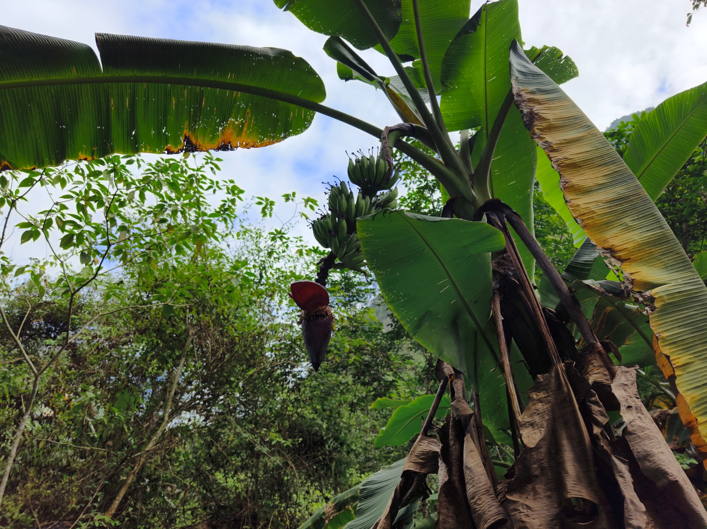
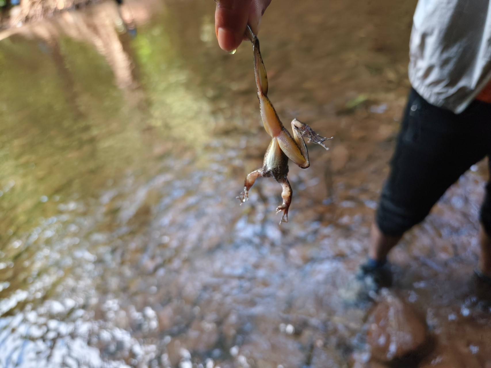
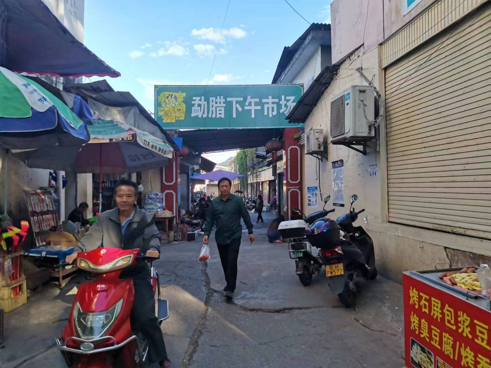
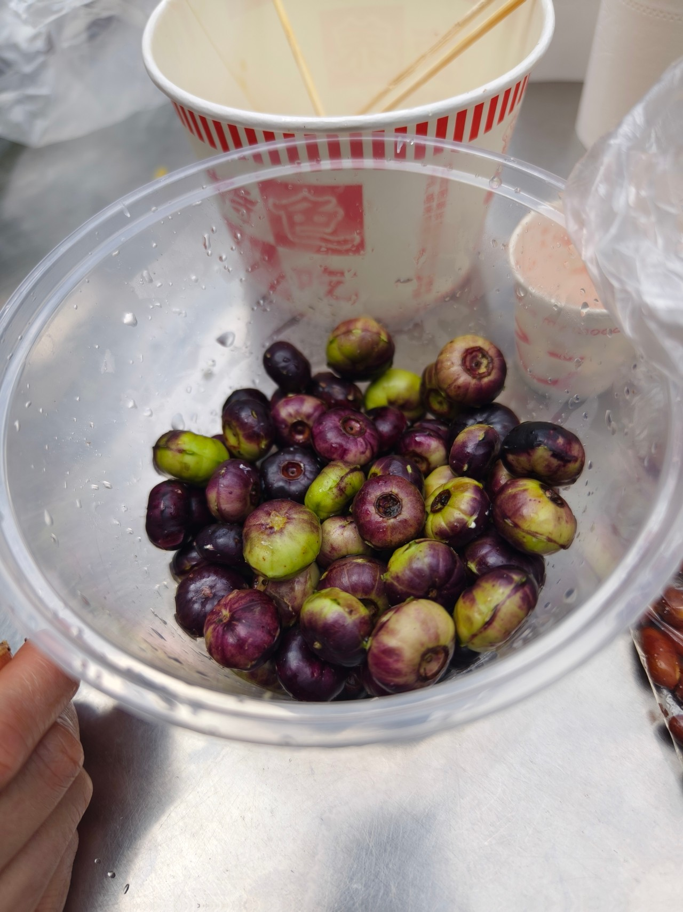

十一月中下旬，我决定把今年的假期用完，于是带着父母和儿子去了一趟云南。我们选择了云南的最南部的西双版纳和最北部的丽江-香格里拉这两块相隔500公里的地方一起游玩。

这个时候，云南的最南部（西双版纳）刚刚才进入旱季，雨水变少，气温变低。但是，比起北回归线以北的广大地区，这里仍然十分温暖。云南的最北部（香格里拉、丽江）则开始进入深秋季节，白天阳光普照，体感舒适，而晚上则接近零度，需要注意保暖。

## 11月18日

我带着儿子从苏州出发，我父母则在老家，从衡阳机场出发，到达西双版纳。

有意思的是，我们乘坐的是同一次航班九元航空AQ1624到达西双版纳机场。这次航班从无锡机场起飞，经停衡阳机场，最后到达西双版纳机场。我父母并不知道我和我儿子会在衡阳机场和他们碰头，所以算是给了他们一个小小的惊喜。

抵达西双版纳机场已是晚上十点，我选择了机场附近一家酒店就近休息。这个季节的西双版纳可能是旅游淡季，酒店非常便宜，花300元住的两间房间空间很大，条件还不错。

## 11月19日

一早吃完早饭，我在酒店门口和租车公司办完了租车手续。我租的是红旗E-QM5，一辆中大型纯电动轿车，**总价190元3天**，便宜到有点夸张的程度！我妈妈一坐上后排，就说这比暑假花了400块一天租的沃尔沃S90坐着还要更舒服。

后来，我通过网上了解才知道，这款车在一汽红旗的大本营吉林省长春市上牌的话，**裸车价只需要8.8万**！所以，在全国各地大街上能遇到的黑色红旗E-QM5大多数都是挂的吉A牌照。

上午，我们驱车将近两个小时来到勐远仙境景区。这个景区地处偏僻，几乎没有旅游团光顾，特色是“雨林穿越”。这里的门票大小同价，4个人大约1000元，真不便宜。但是因为这种沉侵式的体验具有不可替代性，所以我还是选择西双版纳的第一站就来到这里。

我们四个人由一位叫做“菠萝”的导游带队，乘坐一小段电瓶车之后，出发深入探索位于西双版纳自治州勐腊县勐远乡的这处深山雨林——好吧，其实都是景区的固定路线。

刚一开始走在景区的步道上，我们就陶醉在两侧高大浓密的植被里。

导游不断给我们介绍各种植物和虫子。

我们看到了橡胶树和芭蕉树，知道了芭蕉树上的花是可以当蔬菜吃的。

我们看到了蚂蚁会把裂开的叶子缝起来。

我们看到了只在书上见过的树枝虫。

在到达一处千年绞杀榕之后，我们离开“铺装路面”，开始行走在密林里的土路上。

遗憾的是，我们一路上只看到虫子，没有看到蛇。按照导游的叙述，前两天还在路边的书上看到竹叶青的。导游说，竹叶青是懒蛇，人不攻击它它是不会攻击人的，所以比较安全。

我们一路往前走，路变得越来越艰难。有许多大树三年前刚刚倒下，挡住了一部分小道。好在导游在前面牵着我儿子走，让人很放心。

此时，开始有了一点点太阳光照射进密林里。我意识到自己已经浸泡在绿色的海洋里了，感觉呼吸畅快了不少。

最终我们达到一处河岸边，便不能往前走了。按照景区的固定路线，之后我们要从这里折返，溯溪而下。

导游带着小朋友在河里摸鱼，抓树蛙，还有荡秋千。小朋友对他可以毫无顾忌地在河里踩水这件事情感到很兴奋。穿着鞋子踩在水里我感觉还是微微有点凉。

接下来溯溪而下的时候，我们要反复穿越河流。水流的最深处没及膝盖，我们需要手拉手通过，否则有滑倒的危险。

在一处树下的河水里，导游发现一条手掌那么长的毛毛虫。他说这是野生的蚕。看起来有接近手掌那么长，我们盯着看了好久。最后导游把它捞回到树上，说在水里这条蚕肯定会活不下去的。

历经三个多小时的穿越，我们最终回到了景区大门口。景区提供姜茶给游客驱寒，还给小朋友发放了一张“志愿者服务证书”。

这趟旅程我感觉总体还是值得的。这个季节能看到的野生动物确实不多，算是小小的遗憾吧——也许以后我们还会在暑假的时候再来一次。

下午，我们驱车到达勐腊县城。此时还是四点左右，饭馆还没有晚饭吃。办理酒店的入住手续之后，我们开始寻找农贸市场。农贸市场现在几乎是我们每到一个地方必逛的“旅游景点”了——因为往往这里有在其他地方看不到的各种土产和食物。

最终我们找到一处“下午市场”，在这里买了许多水果，包括一种从来没见过的土产浆果，形状像蓝莓，但号称其花青素含量是蓝莓的数倍。我已经不记得它的名字了。

## 11月20日

这天，我们计划去勐腊县东北半个小时车程的望天树景区游览。由于摸不准景区的情况，我们从酒店老板那里花每人140元购买了望天树景区所谓的“水-陆-空”套票。

一开始，是到达一个码头之后停好车，乘船游览一段澜沧江的支流——南腊河。我感觉这段乘船的行程其实乏善可陈，河两岸都是普普通通的森林景观。抵达终点码头下船之后，我们才算是到达了景区真正的大门口。

刚一进到大门口，小朋友就被一些科普性的展板留住了脚步。

一见到展板上的“兰花螳螂”，我儿子就说这是兰花。他还不认识兰花这俩字，估计是他姥姥给他看过兰花的样子。

由于没有请导游，进到入口这段路上的各种植物我们都只是走马观花看了一下。然后，我们到达这个景区的标志性景观“树冠走廊”——这就是景区所谓的空中部分。景区搭建了一系列高空吊桥，这些吊桥的两端栓在几十米高的望天树的腰部。游客需要从几十米高的吊桥上走过。

我走完这一系列吊桥之后，感觉惊险有余，景色不足。所以，望天树景区所谓的“水-陆-空”三维景观，“水”和“空”的部分我都不是很推荐。而公园本身的大门票只需要55元，这55元才是真正值得花的。毕竟，望天树景区里有中国第二高的树，高达80多米。而它第一高树的名头可能还是最近两年才被墨脱发现的那棵树给夺走的。

此外，我儿子还在这里荡了可能是中国最高的树上秋千。他玩了半个小时这个秋千才舍得离开。

出了景区之后，傍晚，我们在勐腊县城一家湘菜馆吃饭。通过饭店老板才知道勐腊县这里的一多半外地人都来自湖南祁东县——和我的老家都同样属于衡阳市。吃完晚饭后，我们连夜赶往了勐仑镇。这个镇上有西双版纳最受欢迎的景点——中科院热带植物园。果不其然的是，晚上我们入住的酒店老板也还是祁东县人。

## 11月21日